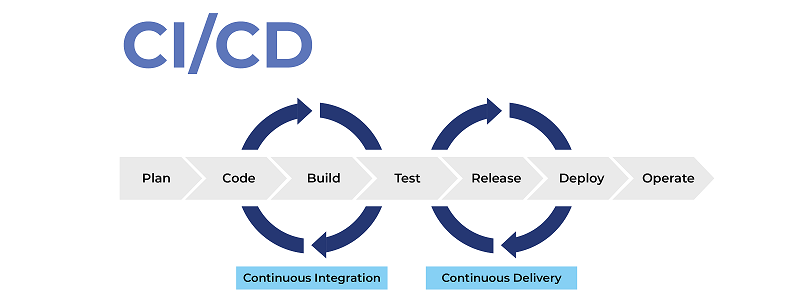
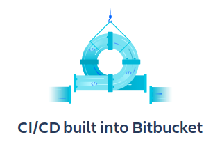

# CI/CD

CI y CD son siglas de los términos ingleses "Continuous Integration" y "Continuous Delivery", alguna vez se refiere a "Continuous Deployment". En español sería Integración Continua y Entrega Continua o Desplieague Continuo. 

La combinación de todas estas técnias se conoce como Desarrollo Continuo de Software.

### Continuous Integration

Consiste en ir añadiendo sucesivos pequeños cambios a una rama principal. 

### Continuous Delivery

Producción de código en cilcos cortos y rápidos, permitiendo el despleigue de software estable de manera frecuente y de forma fiable.

### Continuous Deployment

El software nuevo se despliega de forma automática y continuada.

Bitbucket provee herramientas para aplicar ambas técnicas a la metodología de trabajo de sus usuarios.

