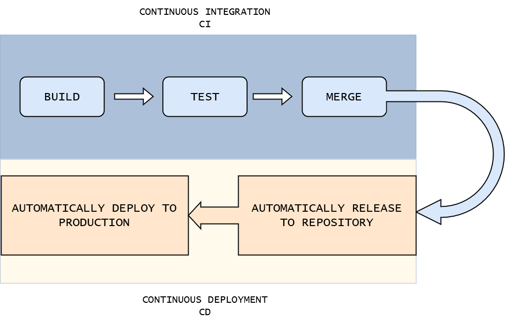

  

# 
 Bitbucket 

## ¿Qué son las herramientas CI/CD?

 

CI y CD son las siglas correspondientes a Continous Integraition y Continuous Deployment.

El concepto de Continous Integretaion se basa en la automatización de la integración de nuestro código a un repositorio central, donde 
cada commit que se realiza ejecuta un conjunto de tareas o tests encargados de verificar que el código es apto para hacer un merge sobre
la rama main o master.

Por otro lado el Contious Deployment, donde todo código que se encuentra testeado se despliega automáticamente bien en un servidor de testing o en un servidor de producción.

Existen diversas herramientas de terceros para CI/CD como puede ser Circleci, TC, Buddy, Concourse, entre otras. Pero sin embargo, la más popular de las herramientas de integración conitnua es Jenkins.

 

 

Por otro lado cada herramienta de gestión de proyectos puede tener la suya propia. En nuestro caso Atlassian (propietario de Bitbucket) cuenta con la herramienta de integración y despliegue Bamboo. Además en el caso de que el hosting se realice con Bitbucket Cloud, existe una herramienta CI/CD integrada llamada Pipelines.

 

 

Hay que tener en cuenta, además, que el uso de la herramienta de integración y despliegue es independiente de la herramienta de gestión de proyectos que se esté utilizando. Esto quiere decir que Bitbucket podria utilizarse junto con CI/CD Gitlab por ejemplo, sin ningún problema.

En resumen las herramientas CI/CD simplifican el trabajo del desarollador, permitiendole definir una serie de reglas que automaticen en gran medida el flujo de trabajo posterior a la elaboración del código.

