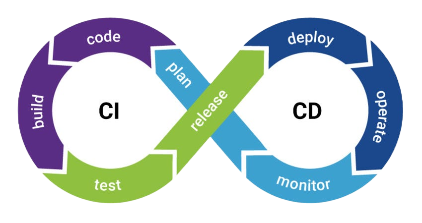

# ¿Qué son las herramientas CI/DC?

Bitbucket tiene integrado una forma para evalúa automáticamente el código que has creado que consiste en CI/CD que es un método para distribuir las aplicaciones, mediante el uso de la automatización en las etapas del desarrollo de las aplicaciones. Los principales conceptos de esta aplicación son la integración, la distribución y la implementación continuas.
 
 

 
 

## Integración continua

La integración continua (CI) permite que los desarrolladores funcionen los cambios en un repositorio compartido para haci evitar un conflicto con las modificaciones que otros desarrolladores implementan al mismo tiempo.

## Distribución continua

La distribución continua (CD) consiste en tener una base de código que pueda implementarse en el entorno de producción en cualquier momento.

## Implementación continua

La implementación continua (CI/CD) es el encargado de automatizar el lanzamiento de la aplicación a la producción.
 
 

[Bitbucket](../README.md)