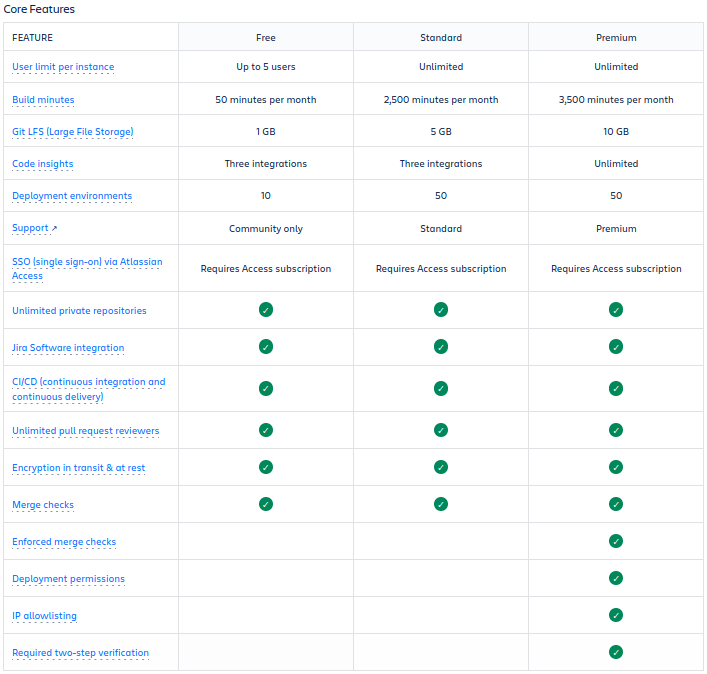
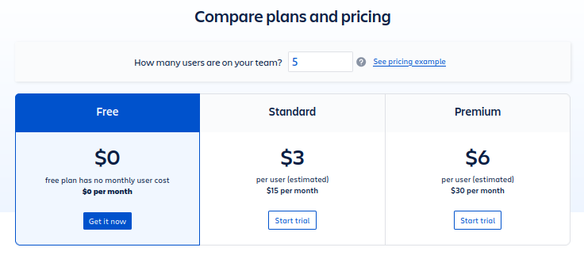
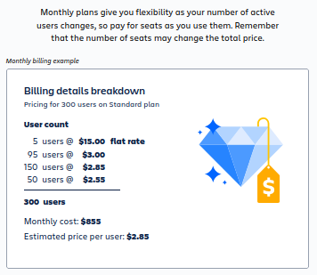
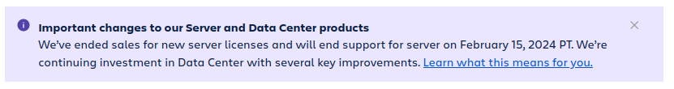
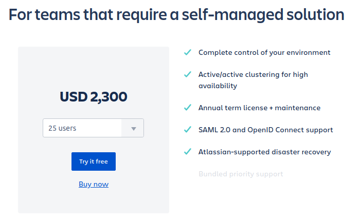
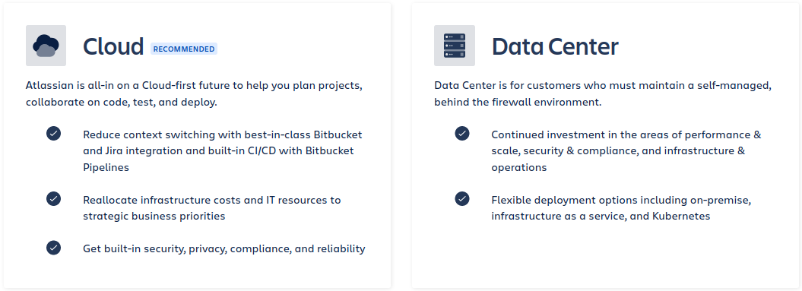

# Cuenta de Prueba

## Planes y precios

Los precios varían en función del tipo de plan, la cantidad de usuarios y el tipo de hosting. Atlassian nos da una calculadora para poder indicar nuestras necesidades aproximadas y obtener una estimación instantánea de lo que nos costaría.

### Bitbucket Cloud

Tenemos tres categorías de plan: gratuito, estándar y premium.

    

Si suponemos un equipo de 5 usuarios, la cantidad máxima permitida dentro de la modalidad gratuita, los saltos de precio son los siguientes.

    

Un ejemplo que Atlassian nos da como referencia sería:

    

En el ejemplo de factura se puede ver como se han ido contratando capacidad de usuarios a medida que se fue necesitando. Esta flexibilidad es interesante de cara a poder absorber imprevistos que surjan en el día a día del proyecto o empresa.

### Bitbucket Server

Esta opción parece ser un producto que ha dejado de tener sentido dentro de los planes de Atlassian.

    

Ya no venden licencias y además avisan de que dejarán de dar servicio en febrero de 2024.

### Bitbucket Data Center

Una opción en la que Atlassian esta centrando sus esfuerzos. Pensado ya para coordinar equipos de mayor  tamaño. Se pierde flexibilidad a la hora de contratar usuarios. Las primeras opciones de usuarios/precio(USD) son: 

<ul>
    <li>25 usuarios, 2.300$</li>
    <li>50 usuarios, 4.200$</li>
    <li>100 usuarios, 7.600$</li>
    <li>250 usuarios, 15.200$</li>
    <li>500 usuarios, 20.200$</li>
    <li>1000 usuarios, 30.400$</li>
</ul>

Por referencias, la cantidad máxima seleccionable es 30.000 usuarios con un coste de 910.800$.

A partir de 250 usuarios contratados se dispone de servicio de atención prioritario. 

    

### Comparativa Data Center y Cloud

Atlassian dedica una sección a dicha comparativa, ofreciendo incluso distintos niveles de detalle para diferentes tipos de usuario. Una primera comparativa a un nivel muy básico sería la siguiente:

    

## Cuenta gratuita de prueba

