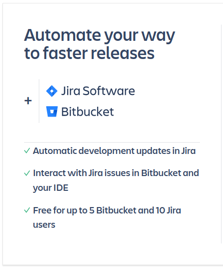
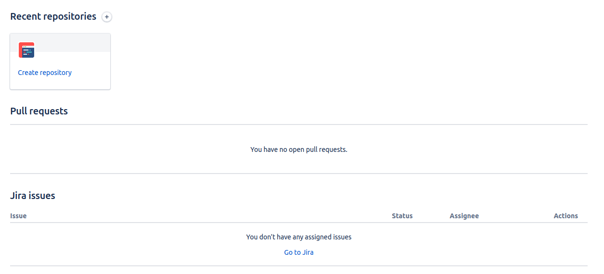
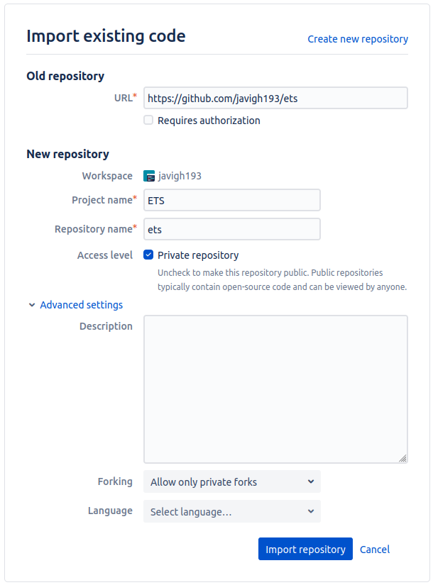
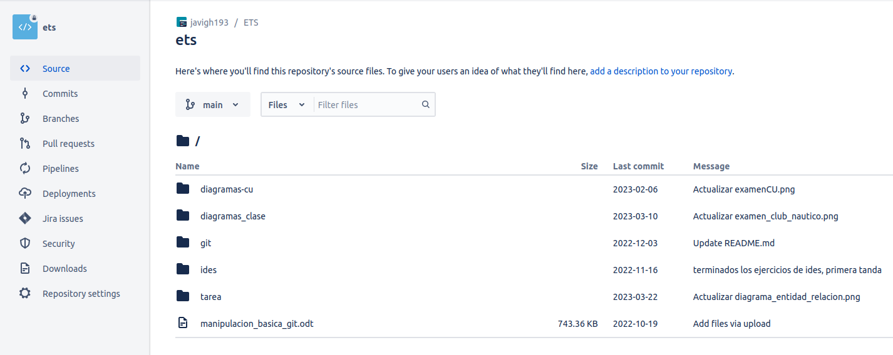
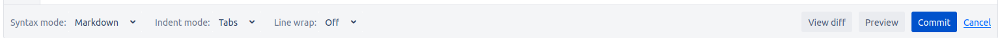

# Cuenta de Prueba

## Planes y precios

Los precios varían en función del tipo de plan, la cantidad de usuarios y el tipo de hosting. Atlassian nos da una calculadora para poder indicar nuestras necesidades aproximadas y obtener una estimación instantánea de lo que nos costaría.

### Bitbucket Cloud

Tenemos tres categorías de plan: gratuito, estándar y premium.

    

Si suponemos un equipo de 5 usuarios, la cantidad máxima permitida dentro de la modalidad gratuita, los saltos de precio son los siguientes.

    

Un ejemplo que Atlassian nos da como referencia sería:

    

En el ejemplo de factura se puede ver como se han ido contratando capacidad de usuarios a medida que se fue necesitando. Esta flexibilidad es interesante de cara a poder absorber imprevistos que surjan en el día a día del proyecto o empresa.

### Bitbucket Server

Esta opción parece ser un producto que ha dejado de tener sentido dentro de los planes de Atlassian.

    

Ya no venden licencias y además avisan de que dejarán de dar servicio en febrero de 2024.

### Bitbucket Data Center

Una opción en la que Atlassian esta centrando sus esfuerzos. Pensado ya para coordinar equipos de mayor  tamaño. Se pierde flexibilidad a la hora de contratar usuarios. Las primeras opciones de usuarios/precio(USD) son: 

<ul>
    <li>25 usuarios, 2.300$</li>
    <li>50 usuarios, 4.200$</li>
    <li>100 usuarios, 7.600$</li>
    <li>250 usuarios, 15.200$</li>
    <li>500 usuarios, 20.200$</li>
    <li>1000 usuarios, 30.400$</li>
</ul>

Por referencias, la cantidad máxima seleccionable es 30.000 usuarios con un coste de 910.800$.

A partir de 250 usuarios contratados se dispone de servicio de atención prioritario. 

    

### Comparativa Data Center y Cloud

Atlassian dedica una sección a dicha comparativa, ofreciendo incluso distintos niveles de detalle para diferentes tipos de usuario. Una primera comparativa a un nivel muy básico sería la siguiente:

    

## Cuenta gratuita de prueba

### Registro

El registro para probar gratuitamente es muy sencillo, se pide un email para enviar una verificación y se debe definir un nombre de usuario y un nombre del sitio asociado al usuario. 

Me dan a elegir si quiero probar la integración con Jira ( también gratuitamente ), marco que sí. 

    

Una vez terminados los procesos de creación correspondientes, me redirigen a mi 'workspace'. 

La interfaz es bastante ligera, con una barra de navegación partida en dos, por un lado la navegación entre subpáginas de la gestión de los proyectos y por otro lado los recursos de búsqueda, ayuda, perfil y configuración. El resto de la página sigue una distribución vertical en la que primero me muestra repositorios, debajo pull requests y por último issues. Ahora mismo todas las secciones están vacías. 

    

    

    

### Integrar un repositorio de Git

Desde mi workspace tengo la opción de crear un repositorio o bien importarlo, opto por la última opción.

    

Una vez dentro del repositorio la interfaz mantiene su sencillez, un menú de navegación en el margen izquierdo y una zona principal donde se muestra la información correspondiente al punto en el que nos encontramos.  

    

Es muy práctico disponer del menú general en la parte superior y el menú del repositorio en la parte izquierda. Todas las opciones están a un clic de distancia sin dificultar la visualización en la pantalla de la información tratada en cada momento.

La gestión de ramas, commits y pull requests es similar a Github, la interfaz más limpia, lo cual se agradece.

El resto de funciones escapan a los objetivos actuales de este repositorio, serán evaluados proximamente.

## Documentación

Se pueden editar los documentos online. Permite obtener una previsualización de cómo se vería el documento, trabajar con diferentes sintaxis y visualizar solamente los cambios respecto al documento de partida. 

    

