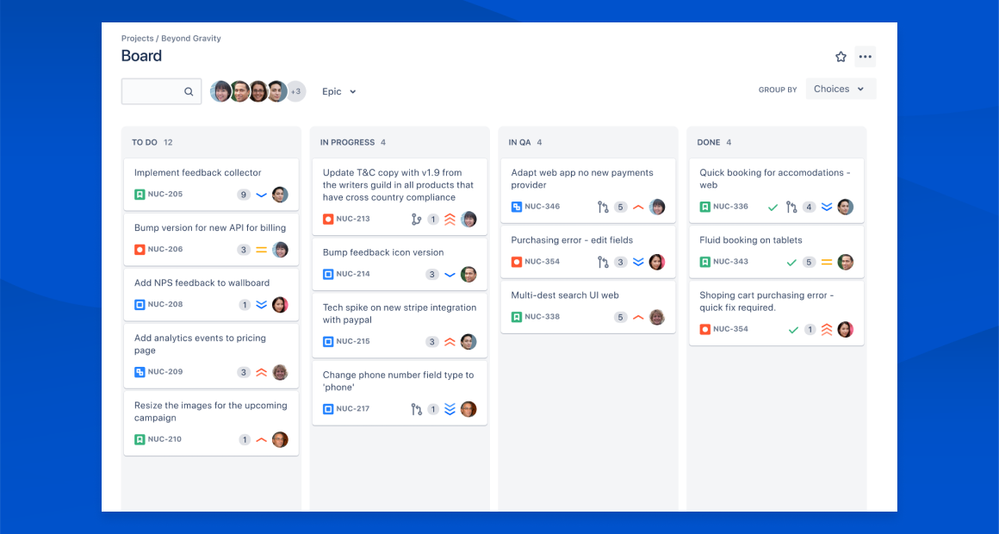
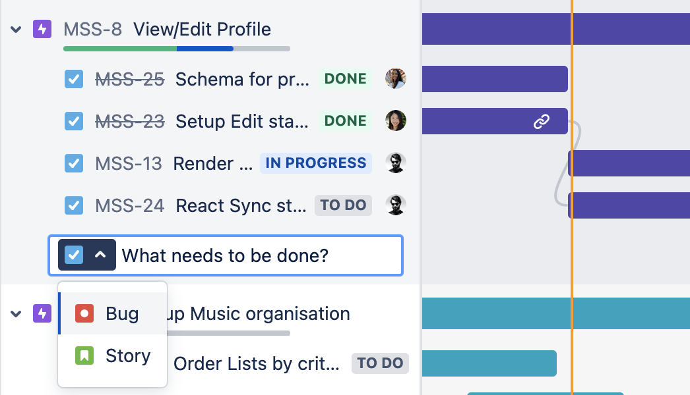
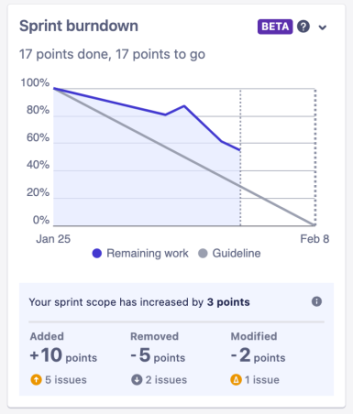
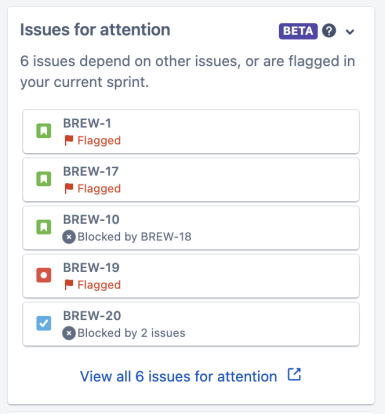
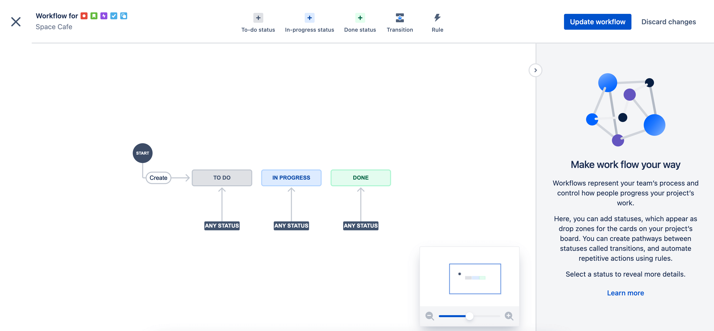
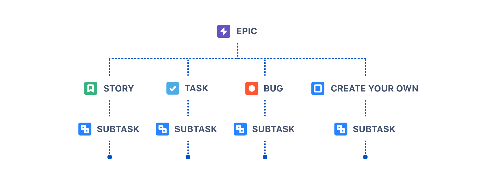
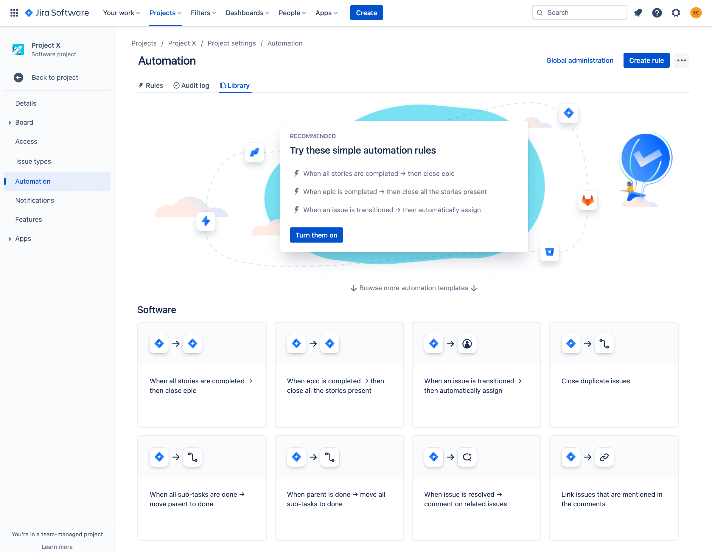

    

Bitbucket está integrado con Jira, una herramienta, también de Atlassian, que permite gestionar equipos aplicando metodologías ágiles. Con Jira puedes gestionar tus proyectos durante todo su ciclo de vida dentro de un único contexto, facilitando así enormemente la coordinación y las tareas de seguimiento.  

Bitbucket avisa automáticamente a Jira de los cambios en el código, de forma que Jira puede generar toda la información asociada a los mismos: actualización de paneles, seguimiento de los "issues" en tiempo real, etc. De esta forma el programador ve aligerada su carga de trabajo asociada a la documentación y se evitan posibles discrepancias entre el estado real del código y el reflejado en las herramientas de gestión del proyecto. 

## Herramientas provistas por Jira

### Paneles

Jira permite la creación de tableros de incidencias para implementar metodologías ágiles como Scrum o Kanban entre otras.

    

### Hojas de ruta

Las hojas de ruta permiten planificar la realización de las tareas sobre un eje temporal. Las tareas más grandes, las principales, se dividen en tareas más pequeñas, las secundarias. Las tareas secundarias son dependientes de la tearea principal que las origina, las dependencias entre diferenetes tareas principales tambíen se ven reflejadas y son tenidas en cuenta a la hora de realizar la planificación. 

    

### Informes

Jira facilita la generación de informes a partir de los datos generados dentro del contexto único de trabajo. Mediante diferentes vistas podemos obtener rápidamente un primer análisis sobre el estado de diferentes aspectos de nuestro proyecto. 

     
    

### Flujos de trabajo

Jira permite definir flujos de trabajo para los distintos tipos de incidencia existentes en el proyecto. Estos flujos de trabajo se pueden reutilizar en diferentes proyectos, generando así un marco de trabajo uniforme, tanto para los desarrolladores como para los ingenieros. 

     

### Incidencias y tareas

Las incidencias y tareas se pueden definir de manera similar a los flujos de trabajo. En Jira se pueden establecer relaciones jerárquicas entre los diferentes tipos de incidencias y tareas, así como indicar dependencias con otras ramas.

     

### Integraciones

Atlassian dispone de un 'Marketplace' donde obtener aplicaciones que son totalmente integrables con Jira. Estas aplicaciones o 'plugins' permiten ampliar y mejorar las funcionalidades de la instancia de Jira.

<a href="https://marketplace.atlassian.com/">Marketplace de Atlassian</a>

### Automatización

La automatización de tareas de Jira consiste en programar una serie de reglas dentro del contexto de trabajo. Estas reglas constan de tres partes:

<ol>
    <li>Desencadenadores o "Triggers"</li>
    <li>Condiciones</li>
    <li>Acciones</li>
</ol>

Combinando estos tres elementos se pueden programar desde tareas sencillas, como cerrar automaticamente una incidencia, hasta tareas complejas que impliquen la comprobación del estado del proyecto o permisos concedidos a los actores involucrados.

     

