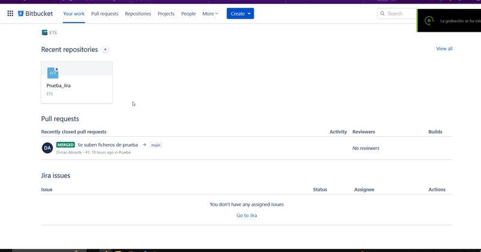

  

 

Para la utilización de Jira será necesario en enlazar el proyecto alojado en Bitbucket sobre el cual queremos trabajar.

Para ello nos situamos sobre el proyecto y en el desplegable situado en la parte izquierda de la pantalla seleccionaremos Jira Issues.

na vez hecho esto solo queda seguir los pasos de enlace.

 

 

