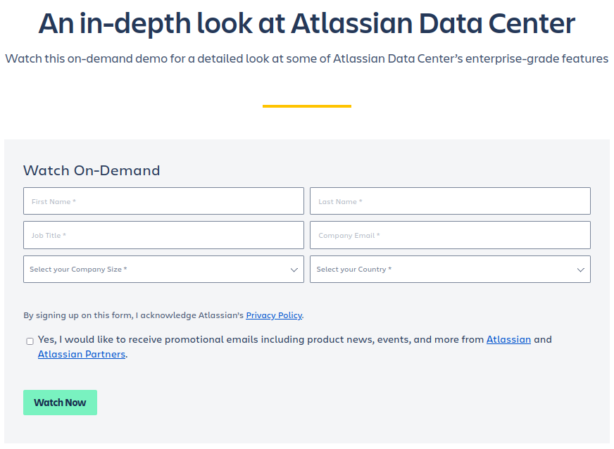
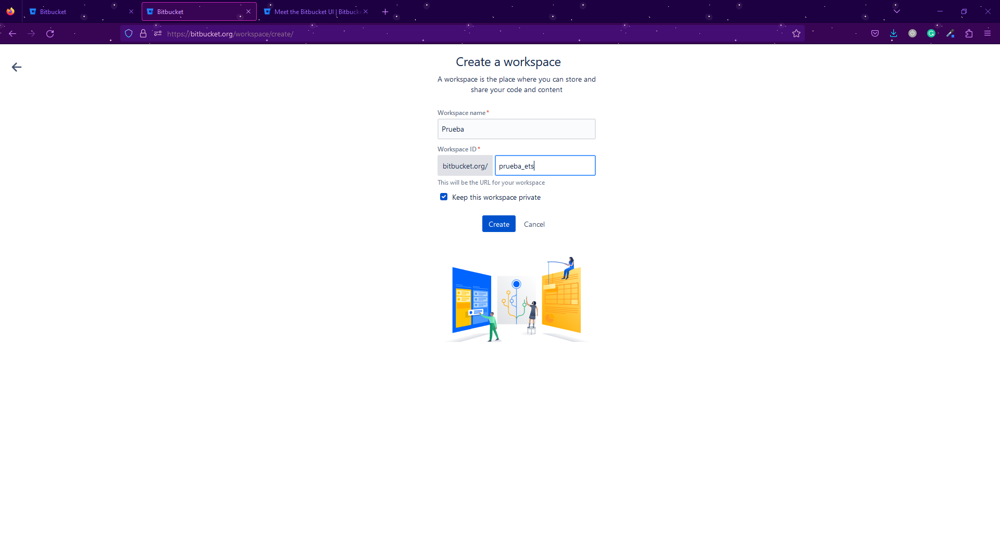
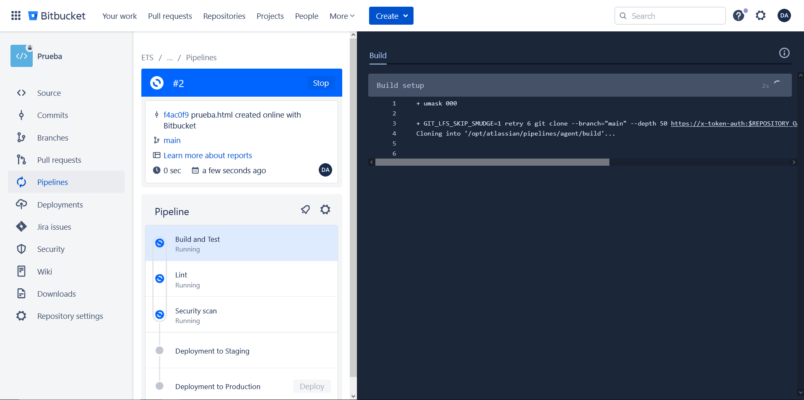
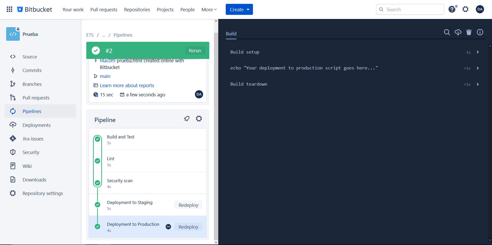
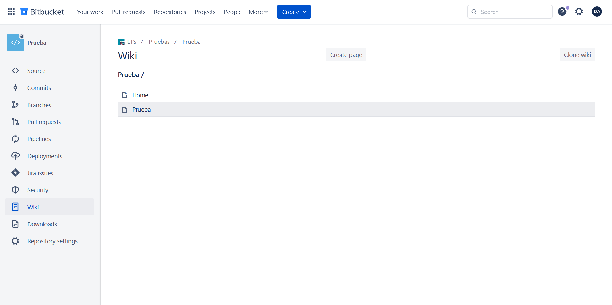
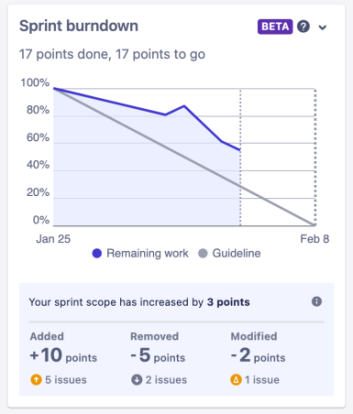
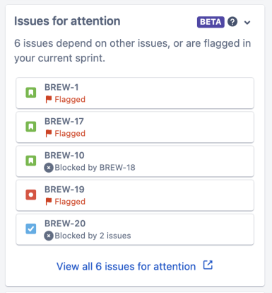
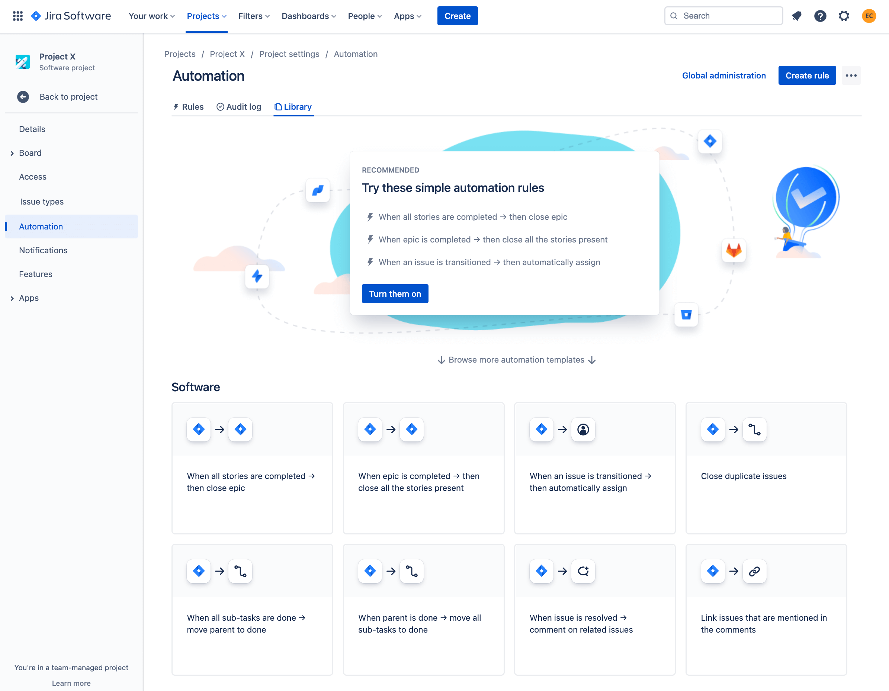
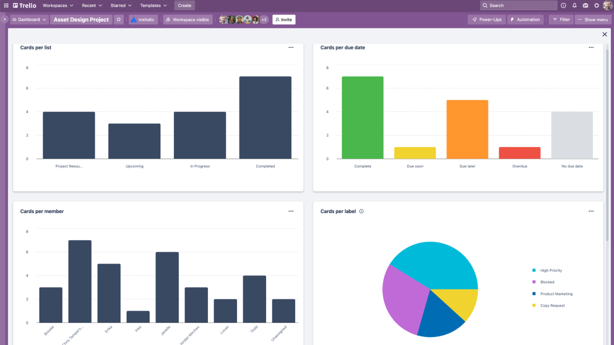
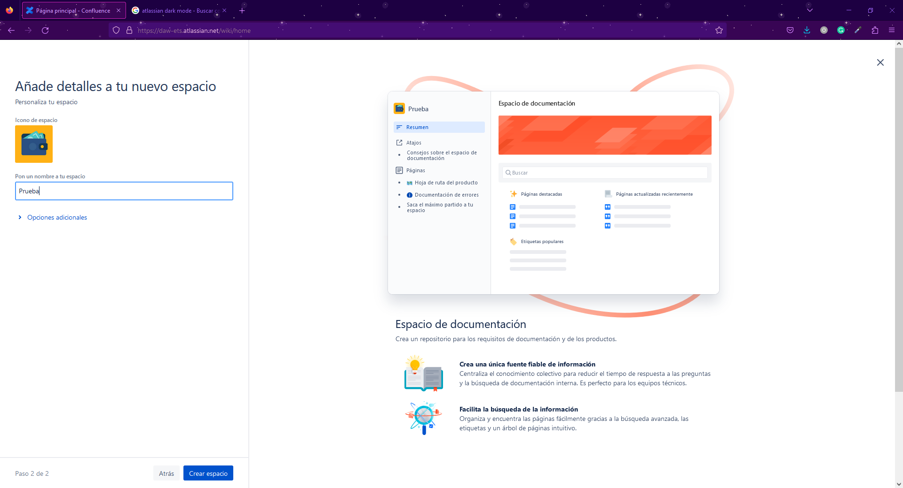

 

## Índice de contenidos

<ul>

<li><a href="#title1">¿Qué es Bitbucket?</a></li>
<li><a href="#title2">¿Qué son las herramientas CI/CD?</a></li>
<li><a href="#title3">Plan de precios</a></li>
<li><a href="#title4">Ejemplo de integración de código</a></li>
<li><a href="#title5">Ejemplo de documentación de proyectos</a></li>
<li><a href="#title6">Otras herramientas con las que se integra</a></li>
<li><a href="#title7">Comparativa con otras herramientas</a></li>
<li><a href="#title8">¿Por qué escoger Bitbucket?</a></li>

</ul>

## 
¿Qué es Bitbucket?

Bitbucket Cloud es un servicio de hosting basado en Git (VCS) y una herramienta de colaboración para facilitar la coordinación de equipos de trabajo. Provee una solución completa para implementar un Desarrollo Continuo de Software (CI + CD). 

Uno de sus puntos fuertes es su integración con Jira y Trello, ambas herramientas del mismo desarrollador de Bitbucket: Atlassian.

## 
¿Qué son las herramientas CI/CD?

CI y CD son las siglas correspondientes a Continous Integration y Continuous Deployment.

El concepto de Continous Integration se basa en la automatización de la integración de nuestro código a un repositorio central, donde 
cada commit que se realiza ejecuta un conjunto de tareas o tests encargados de verificar que el código es apto para hacer un merge sobre
la rama main o master.

Por otro lado el Contious Deployment, donde todo código que se encuentra testeado se despliega automáticamente bien en un servidor de testing o en un servidor de producción.

 

    

 

Existen diversas herramientas de terceros para CI/CD como Circleci, TC, Buddy, Concourse, entre otras. La más popular de las herramientas de integración continua es Jenkins.

 

    

 

Cada herramienta de gestión de proyectos puede tener la suya propia. Atlassian cuenta con la herramienta de integración y despliegue Bamboo. En el caso de que el hosting se realice con Bitbucket Cloud, existe una herramienta CI/CD integrada llamada Pipelines.

 
    

    

    
 

Hay que tener en cuenta que el uso de la herramienta de integración y despliegue es independiente de la herramienta de gestión de proyectos que se esté utilizando.Bitbucket podría utilizarse junto con CI/CD de Gitlab, por ejemplo.

En resumen las herramientas CI/CD simplifican el trabajo del desarollador, permitiendole definir una serie de reglas que automaticen en gran medida el flujo de trabajo posterior a la elaboración del código.

## 
Plan de precios

Los precios varían en función del tipo de plan, la cantidad de usuarios y el tipo de hosting. Atlassian nos da una calculadora para poder indicar nuestras necesidades y obtener una estimación instantánea de lo que nos costaría.

### Bitbucket Cloud

Tenemos tres categorías de plan: gratuito, estándar y premium.

 

    

 

Si suponemos un equipo de 5 usuarios, la cantidad máxima permitida dentro de la modalidad gratuita, los saltos de precio son los siguientes.

 

    

 

### Bitbucket Server

Esta opción parece ser un producto que ha dejado de tener sentido dentro de los planes de Atlassian.

 

    

 

### Bitbucket Data Center

Una opción en la que Atlassian esta centrando sus esfuerzos. Pensado para coordinar equipos de mayor  tamaño, que necesitan mayor control sobre el entrono. Se pierde flexibilidad a la hora de contratar usuarios. Las primeras opciones de usuarios/precio(USD) son: 

<ul>
    <li>25 usuarios, 2.300$</li>
    <li>50 usuarios, 4.200$</li>
    <li>100 usuarios, 7.600$</li>
    <li>250 usuarios, 15.200$</li>
    <li>500 usuarios, 20.200$</li>
    <li>1000 usuarios, 30.400$</li>
</ul>

Por referencias, la cantidad máxima seleccionable es 30.000 usuarios con un coste de 910.800$.

 

    

 

Se puede solicitar una demo:

 

    

 

### Comparativa Data Center y Cloud

 

    

 

## 
Ejemplo integración de código

Una vez nos hemos registrado en Bitbucket (se podrían utilizar cuentas creadas con Google, Github, etc. ), el siguiente paso es crear nuestro workspace, el cual tendrá un nombre y una url única.

Un workspace es un espacio donde podremos agrupar todos nuestros repositorios dedicados a un tema en concreto. Es posible tener más de un workspace, lo que nos permite una mejor organización.

 

 

 

 

 

 

 
    
Una vez creado el repositorio podrá ser clonado en local por medio de HTTPS o SSH.

 
    

 

 

Se puede realizar la gestión de las ramas mediante menús:

 

 

 

 

 

 

### Pipelines

Como se ha mencionado en apartados anteriores, Bitbucket Cloud cuenta con una herramienta CI/CD integrada, Pipelines. Ésta nos permite, a través de un fichero yml la automatización de procesos de integración y despliegue.

Para acceder a la creación de nuestro pipeline existen dos opciones. Se puede crear de forma manual, añadiendo un fichero yml desde cero, o bien pueden utilizarse las plantillas que proporciona la propia herramienta. 

Para poder habilitar Pipelines se deberá habilitar primero la verificación en dos pasos.

 

 

 

A continuación se muestran algunas de las plantillas disponibles:

 

 

El fichero yml que se creará cuenta con una serie de apartados. En primer lugar encontramos la imágen que se va a utilizar, en este caso se trata de una máquina ubuntu, por lo que los scripts que se lanzarán serán en bash. Seguido de esto se encuentran una serie de pasos, cada uno con sus nombres y su script.

Además de todo esto, la interfaz de creación cuenta con un apartado de plantillas, opciones para añadir nuevos steps así como una amplia variedad integraciones.

 

A continuación el fichero yml en cuestión:

    # This is an example Starter pipeline configuration
    # Use a skeleton to build, test and deploy using manual and parallel steps
    # -----
    # You can specify a custom docker image from Docker Hub as your build environment.

    image: atlassian/default-image:3

    pipelines:
    default:
        - parallel:
        - step:
            name: 'Build and Test'
            script:
                - echo "Your build and test goes here..."
        - step:
            name: 'Lint'
            script:
                - echo "Your linting goes here..."
        - step:
            name: 'Security scan'
            script:
                - echo "Your security scan goes here..."
    branches: 
        main: 
        - parallel:
        - step:
            name: 'Build and Test'
            script:
                - echo "Esto es para probar"
        - step:
            name: 'Lint'
            script:
                - echo "Sigo probando"
        - step:
            name: 'Security scan'
            script:
                - echo "Magnífico"

    # The following deployment steps will be executed for each pipeline run. To configure your steps and conditionally deploy see https://support.atlassian.com/bitbucket-cloud/docs/configure-bitbucket-pipelinesyml/
    - step:
        name: 'Deployment to Staging'
        deployment: staging
        script:
          - echo "Your deployment to staging script goes here..."
    - step:
        name: 'Deployment to Production'
        deployment: production
        script:
          - echo "Your deployment to production script goes here..."

 

 

Por defecto el proceso CI/CD se ejecutará tras realizar un commit. 

Una vez realizado el proceso especificado en el trigger se irán realizando de manera secuencial los pasos descritos en el yml. 

 

 

 

 

En este caso en particular, se ha especificado en el yml que el despliegue a producción se deba hacer de forman manual, es por esto que en la última imágen mostrada no aparece el 'deployment to production' como finalizado.

 

 

## 
Ejemplo documentación de proyecto

### Editor de documentos

Se pueden editar los documentos online. Permite obtener una previsualización de cómo se vería el documento, trabajar con diferentes sintaxis y visualizar solamente los cambios respecto al documento de partida. 

 

    

 

### Wikis

La creación de wikis en Bitbucket es muy sencilla. Simplmente habrá que habilitarla dentro de las opciones de nuestro repositorio. Una vez hecho esto se podrá elegir el tipo de wiki que deseamos crear: pública o privada. Existe la opción de permitir que cualquier persona con acceso a la misma pueda editarla.

 

 

 

 

En el siguiente apartado se mostrará otra forma de realizar documentación a través de Confluence.

## 
Otras herramientas con las que se integran
 

 

 

Bitbucket está integrado con Jira, una herramienta, también de Atlassian, que permite gestionar equipos aplicando metodologías ágiles. Con Jira puedes gestionar tus proyectos durante todo su ciclo de vida dentro de un único contexto, facilitando así enormemente la coordinación y las tareas de seguimiento.  

Bitbucket avisa automáticamente a Jira de los cambios en el código, de forma que Jira puede generar toda la información asociada a los mismos: actualización de paneles, seguimiento de los "issues" en tiempo real, etc. De esta forma el programador ve aligerada su carga de trabajo asociada a la documentación y se evitan posibles discrepancias entre el estado real del código y el reflejado en las herramientas de gestión del proyecto. 

### Paneles

Jira permite la creación de tableros de incidencias para implementar metodologías ágiles como Scrum o Kanban entre otras.

 

    

 

### Hojas de ruta

Las hojas de ruta permiten planificar la realización de las tareas sobre un eje temporal. Las tareas más grandes, las principales, se dividen en tareas más pequeñas, las secundarias.

  

    

 

### Informes

Jira facilita la generación de informes a partir de los datos generados dentro del contexto único de trabajo. Mediante diferentes vistas podemos obtener rápidamente un primer análisis sobre el estado de diferentes aspectos de nuestro proyecto. 

 

 

### Flujos de trabajo

Jira permite definir flujos de trabajo para los distintos tipos de incidencia existentes en el proyecto.

 

     

 

### Incidencias y tareas

Las incidencias y tareas se pueden definir de manera similar a los flujos de trabajo. En Jira se pueden establecer relaciones jerárquicas entre los diferentes tipos de incidencias y tareas, así como indicar dependencias con otras ramas.

 

     

 

### Integraciones

Atlassian dispone de un Marketplace donde obtener aplicaciones que son totalmente integrables con Jira. Estas aplicaciones o 'plugins' permiten ampliar y mejorar las funcionalidades de la instancia de Jira.

<a href="https://marketplace.atlassian.com/">Marketplace de Atlassian</a>

### Automatización

La automatización de tareas de Jira consiste en programar una serie de reglas dentro del contexto de trabajo. Estas reglas constan de tres partes:

<ol>
    <li>Desencadenadores o "Triggers"</li>
    <li>Condiciones</li>
    <li>Acciones</li>
</ol>

Combinando estos tres elementos se pueden programar desde tareas sencillas, como cerrar automaticamente una incidencia, hasta tareas complejas que impliquen la comprobación del estado del proyecto o permisos concedidos a los actores involucrados.

 

     

 
    

    

    
 

Trello es una herramienta de gestión de proyectos muy visual y accesible. También aporta posibilidades de automatización de tareas y opciones de personalización de funcionalidades. 

El elemento fundamental entorno al que gira todo es el tablero. El tablero nos aporta una visión general del estado del proyecto. 

 

    

  

## La tarjeta

 

   
    

 

## Vistas

Trello ofrece vistas predefinidas que nos aportan una visión más en detalle de los diferentes aspectos del proyecto. 

### La vista 'Timeline'

 

    

 

### La vista 'Calendar'

 

    

 

### La vista 'Dashboard

 

    

 

Existen otras vistas predefinidas y también la posibilidad de crear vistas personalizadas para adaptarse a las necesidades particulares del usuario. 

### Integración

Trello permite la integración de aplicaciones para ampliar o adaptar sus funcionalidades. 

<a href="https://trello.com/power-ups">Power-ups para Trello</a>

### Automatización

Mediante 'Butler', Trello permite automatizar casi cualquier acción mediante la creación de reglas, comandos y botones. La programación se realiza sin necesidad de escribir el código.

 

    

 

    

 

### ¿Jira o Trello?

https://www.youtube.com/watch?v=slU60fbyj70

    

 

Confluence es una de las herramientas más utilizadas para la creación de wikis.

Esta herramienta se integra muy bien con Jira y Trello. 

Para la utilización de esta herramienta solo será necesaria una cuenta de Atlassian. Una vez ingresamos a la plataforma se establecerá un espacio para organizar nuestra documentación. Confluence nos da la opción de utilizar una serie de plantillas o bien crear nuestro espacio desde cero.

 

    

 

 

Definido el espacio, solo queda la creación de páginas.

 

 

Al igual que en la creación de espacios, cada página puede ser creada desde cero o utilizar plantillas que se ajusten a nuestras necesidades. También existe la posibilidad de importar nuestros propios documentos externos para convertirlos en una página de confluence.

 

 

 

 

Creadas las páginas estas se verán en nuestro espacio de la siguiente manera:

 

 

Por último, Confluence nos brinda la opción de realizar exportaciones de nuestros espacios en formato CSV, HTML, XML y PDF.

 

## 
Comparativa con otras herramientas

### Bitbucket VS GitHub

 

 

La principal diferencia es que Bitbucket está pensado para repositorios privados y GitHub para repositorios públicos. Dicho ésto, a día de hoy ya se pueden tener repositorios privados en GitHub y públicos en Bitbucket, pero los diferentes enfoques dados a cada herramienta en su concepción siguen siendo apreciables. Un ejemplo de las diferentes filosofías es que GitHub puede ser utilizada como una red social para compartir tu código, siguiendo y siendo seguido por otros desarrolladores, opción no existente en Bitbucket.

Otras diferencias notables entre ambas son:

<ul>
<li>Bitbucket puede importar repositorios de Git, Codeplex, GoogleCode, y SVN; GitHub solo puede importar de Git y parcialmente SVN</li>
<li>La interfaz de Bitbucket es más limpia, pero se trata de un aspecto más bien subjetivo</li>
<li>En GitHub solo los repositorios públicos pueden tener wiki, en Bitbucket los repositorios pueden tener wiki independientemente de si son públicos o no.</li>
<li>Para obligar a que las ramas de un repositorio tengan protección mediante permisos, GitHub requiere un plan de pago. En Bitbucket se pueden configurar de esta forma sin importar el plan.</li>
<li>GitHub tiene una gran comunidad de código abierto en la que apoyarse para todo tipo de aspectos relacionados con el desarrollo web. Bitbucket dispone de múltitud de recursos online: webinars, tutoriales, documentación, etc.</li>
<li>Aunque GitHub ofrece planes de pagos con servicios más completos, no dispone de la opción un hosting autogestionado para los usuarios. Como ya vimos, Bitbucket sí ofrece esta opción.</li>
</ul>

## 
¿Por qué escoger Bitbucket?

La principal fortaleza de Bitbucket es su integración con el resto de las herramientas de Atlassian. Su amplio catálogo de aplicaciones nos permite cubrir todas las necesidades de nuestros proyectos dentro de un mismo entorno. 

Otra de las ventajas es que todo está documentado y existen multitud de recursos como tutoriales o webinares para aprender como utilzar las distintas herramientas. 

 

 

Como vimos en el apartado de comparativa con GitHub, si nuestro objetivo es dar a conocer nuestro código y participar en una comunidad open source, Bitbucket no es la opción adecuada. Se trata de una herramienta diseñada para la gestión de proyectos profesionales. 

    
