

    

## Índice de contenidos

<ul>

<li><a href="#title1">¿Qué es Bitbucket?</a></li>
<li><a href="#title2">¿Qué son las herramientas CI/CD?</a></li>
<li><a href="#title3">Plan de precios</a></li>
<li><a href="#title4">Ejemplo de integración de código</a></li>
<li><a href="#title5">Ejemplo de documentación de proyectos</a></li>
<li><a href="#title6">Otras herramientas con las que se integra</a></li>
<li><a href="#title7">Comparativa con otras herramientas</a></li>
<li><a href="#title8">¿Por qué escoger esta herramienta frente a otras?</a></li>

</ul>

## 
¿Qué es Bitbucket?

Bitbucket Cloud es un servicio de 'hosting' basado en Git y una herramienta de colaboración para facilitar la coordinación de equipos de trabajo. Provee una solución completa para implementar un 'Desarrollo Continuo de Software' ( CI + CD ). 

Uno de sus puntos fuertes es su integración con Jira y Trello, ambas herramientas del mismo desarrollador que Bitbucker: Atlassian. La combinación de estas tres herramientas busca cubrir todas las necesidades de un equipo de desarrolladores en su día a día. 

## 
¿Qué son las herramientas CI/CD?

CI y CD son las siglas correspondientes a Continous Integration y Continuous Deployment.

El concepto de Continous Integration se basa en la automatización de la integración de nuestro código a un repositorio central, donde 
cada commit que se realiza ejecuta un conjunto de tareas o tests encargados de verificar que el código es apto para hacer un merge sobre
la rama main o master.

Por otro lado el Contious Deployment, donde todo código que se encuentra testeado se despliega automáticamente bien en un servidor de testing o en un servidor de producción.

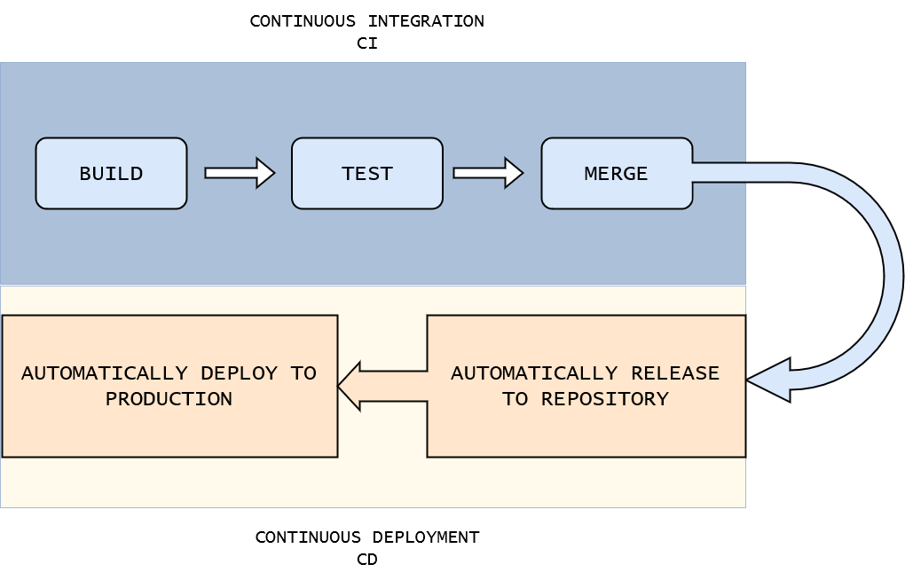

 

Existen diversas herramientas de terceros para CI/CD como puede ser Circleci, TC, Buddy, Concourse, entre otras. Pero sin embargo, la más popular de las herramientas de integración conitnua es Jenkins.

 

Por otro lado cada herramienta de gestión de proyectos puede tener la suya propia. En nuestro caso Atlassian (propietario de Bitbucket) cuenta con la herramienta de integración y despliegue Bamboo. Además en el caso de que el hosting se realice con Bitbucket Cloud, existe una herramienta CI/CD integrada llamada Pipelines.

 

 

Hay que tener en cuenta, además, que el uso de la herramienta de integración y despliegue es independiente de la herramienta de gestión de proyectos que se esté utilizando. Esto quiere decir que Bitbucket podria utilizarse junto con CI/CD Gitlab por ejemplo, sin ningún problema.

En resumen las herramientas CI/CD simplifican el trabajo del desarollador, permitiendole definir una serie de reglas que automaticen en gran medida el flujo de trabajo posterior a la elaboración del código.

## 
Plan de precios

Los precios varían en función del tipo de plan, la cantidad de usuarios y el tipo de hosting. Atlassian nos da una calculadora para poder indicar nuestras necesidades aproximadas y obtener una estimación instantánea de lo que nos costaría.

### Bitbucket Cloud

Tenemos tres categorías de plan: gratuito, estándar y premium.

    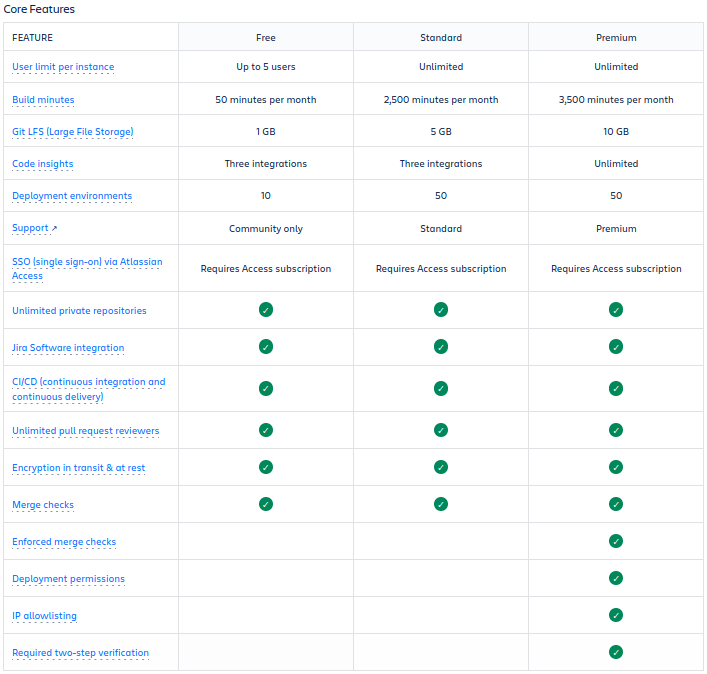

Si suponemos un equipo de 5 usuarios, la cantidad máxima permitida dentro de la modalidad gratuita, los saltos de precio son los siguientes.

    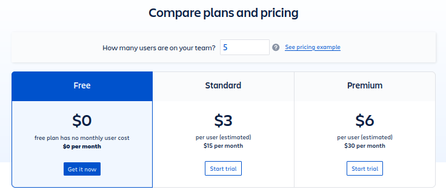

Un ejemplo que Atlassian nos da como referencia sería:

    

En el ejemplo de factura se puede ver como se han ido contratando capacidad de usuarios a medida que se fue necesitando. Esta flexibilidad es interesante de cara a poder absorber imprevistos que surjan en el día a día del proyecto o empresa.

### Bitbucket Server

Esta opción parece ser un producto que ha dejado de tener sentido dentro de los planes de Atlassian.

    

Ya no venden licencias y además avisan de que dejarán de dar servicio en febrero de 2024.

### Bitbucket Data Center

Una opción en la que Atlassian esta centrando sus esfuerzos. Pensado ya para coordinar equipos de mayor  tamaño. Se pierde flexibilidad a la hora de contratar usuarios. Las primeras opciones de usuarios/precio(USD) son: 

<ul>
    <li>25 usuarios, 2.300$</li>
    <li>50 usuarios, 4.200$</li>
    <li>100 usuarios, 7.600$</li>
    <li>250 usuarios, 15.200$</li>
    <li>500 usuarios, 20.200$</li>
    <li>1000 usuarios, 30.400$</li>
</ul>

Por referencias, la cantidad máxima seleccionable es 30.000 usuarios con un coste de 910.800$.

A partir de 250 usuarios contratados se dispone de servicio de atención prioritario. 

    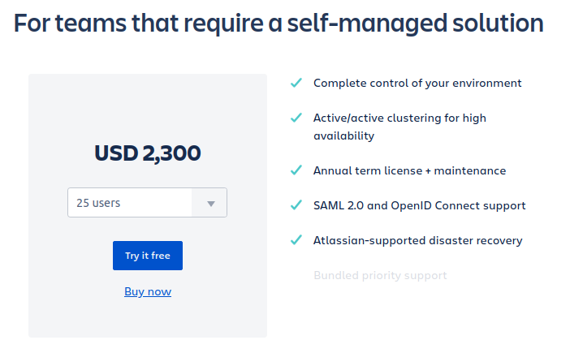

### Comparativa Data Center y Cloud

Atlassian dedica una sección a dicha comparativa, ofreciendo incluso distintos niveles de detalle para diferentes tipos de usuario. Una primera comparativa a un nivel muy básico sería la siguiente:

    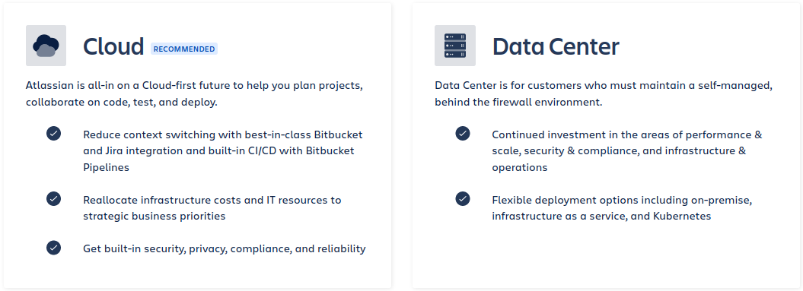

## 
Ejemplo integración de código

 

Una vez nos hemos registrado en Bitbucket (se podrían utilizar cuentas creadas con Google, Github, etc. ), el siguiente paso es crear nuestro workspace, el cual tendrá un nombre y una url única.

Un workspace es un espacio donde podremos agrupar todos nuestros repositorios dedicados a un tema en concreto. Es posible tener más de un workspace, lo que nos permite una mejor organización.

 

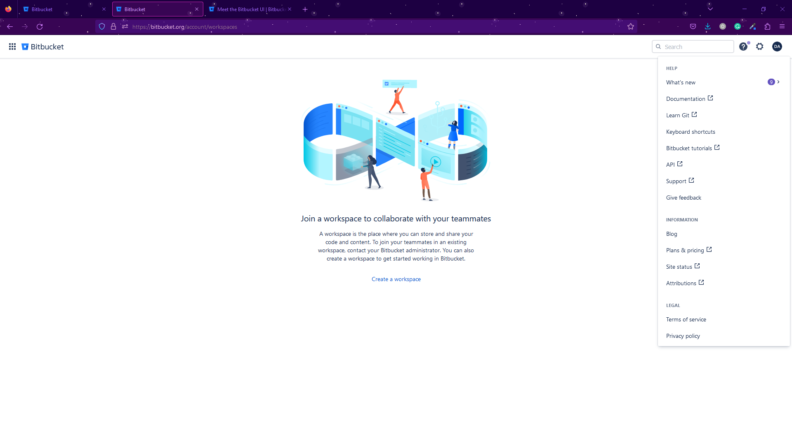

  

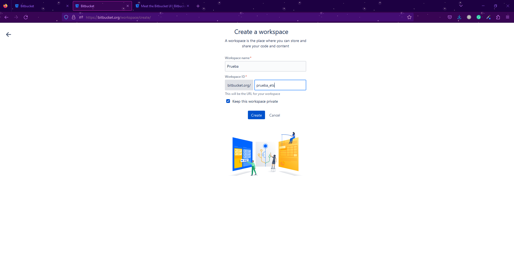

  

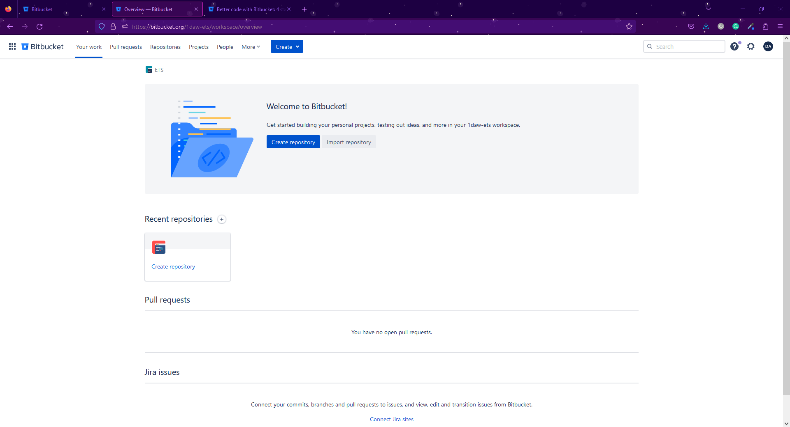

 

Una vez dentro de nuestro Workspace podemos crear nuestro repositorio o un proyecto donde agrupar diferentes repositorios. Podemos configurar diferentes aspectos del repositorio como el tipo de acceso que tendrá el mismo, la inclusión de un README con plantilla, el nombre de la branch principal y la inclusión o no de un .gitignore.

 

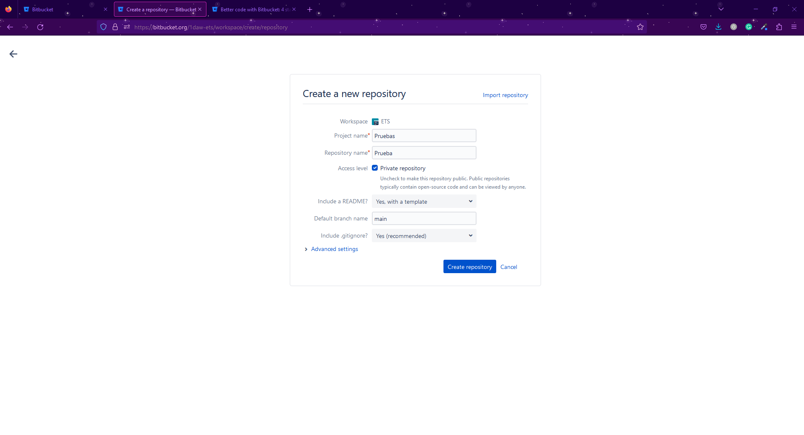

  

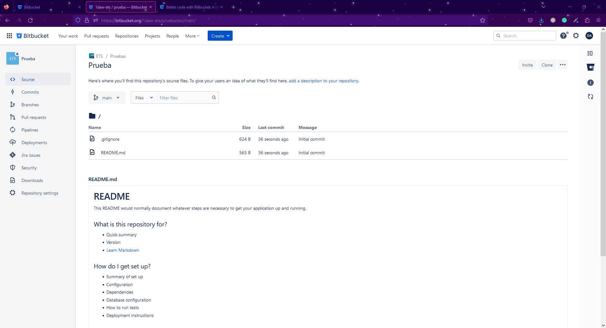

 

Una vez creado el repositorio este podrá ser clonado en remoto por medio de HTTPS o SSH.

 

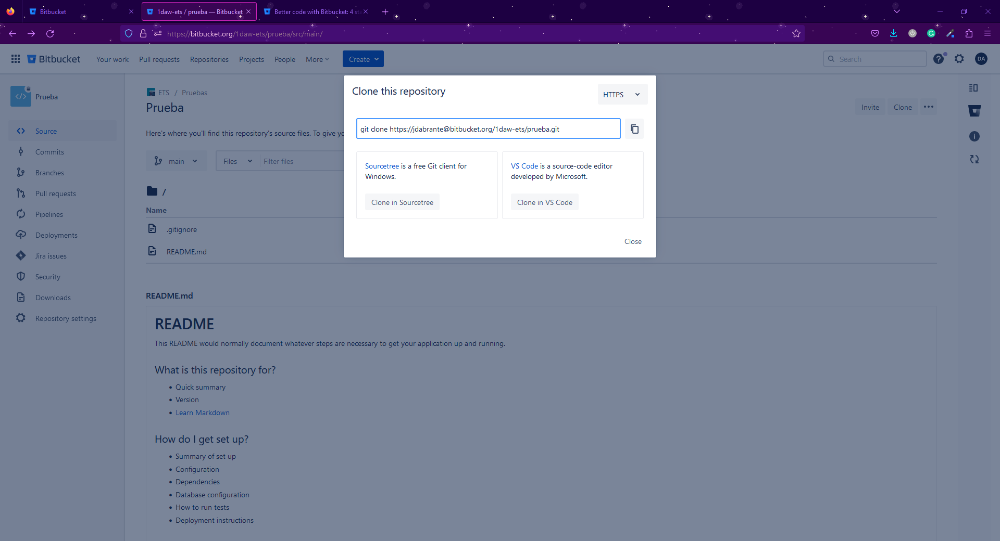

 

Para la creación de una nueva rama en el desplegable de la izquierda se encuentra la opción de "Branches" donde podremos administrar las mismas.
Dentro de esta opción podremos especificar el tipo de rama que vamos a crear, de que otra rama hereda el contenido así como el nombre que le queremos dar.

 

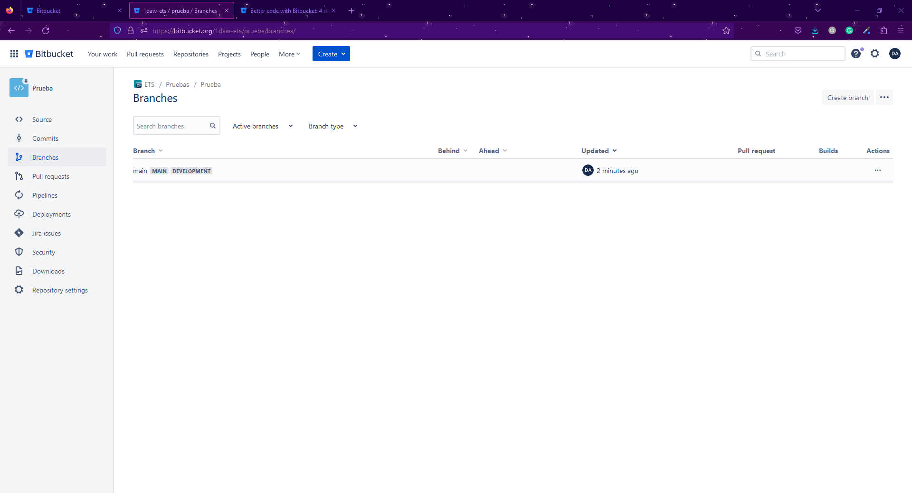

  

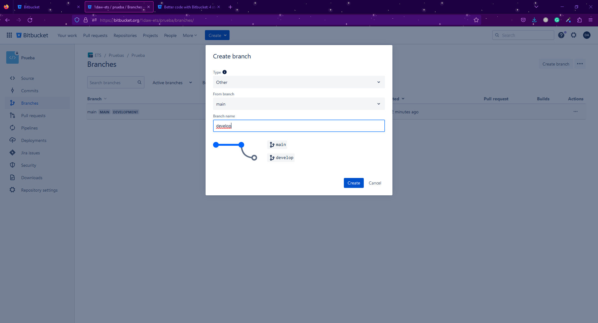

 

La siguiente característica a ver son los pull request. Una vez se haya realizado un cambio en la nueva rama y éste se haya subido al repositorio remoto, se podrá hacer un pull request a otros colaboradores para revisar los cambios y aceptarlos para realizar el merge con la rama main o master.

 

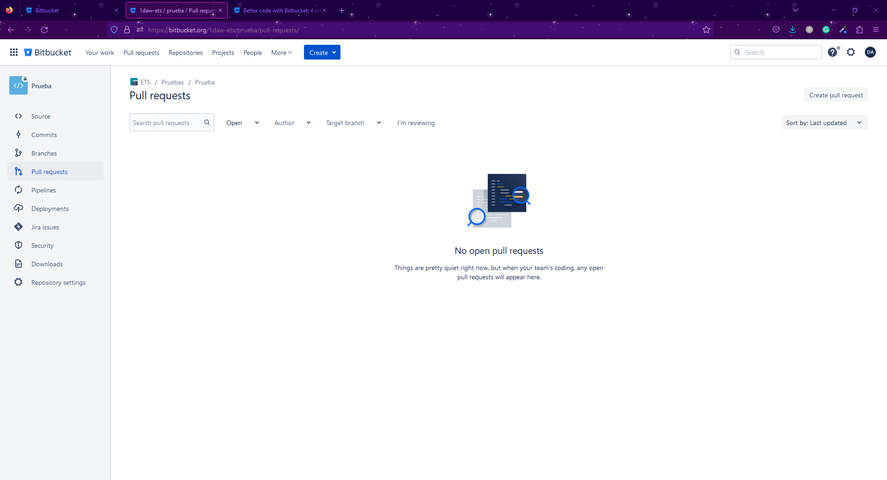

 

En este apartado se puede poner un título al pull request, especificar que ramas se quieren mezclar, una descripción de lo que se ha hecho para que los colaboradores tengan más información, qué colaboradores deben hacer la review así como también si la rama en cuestión ha de borrarse una vez hecho el merge.

 

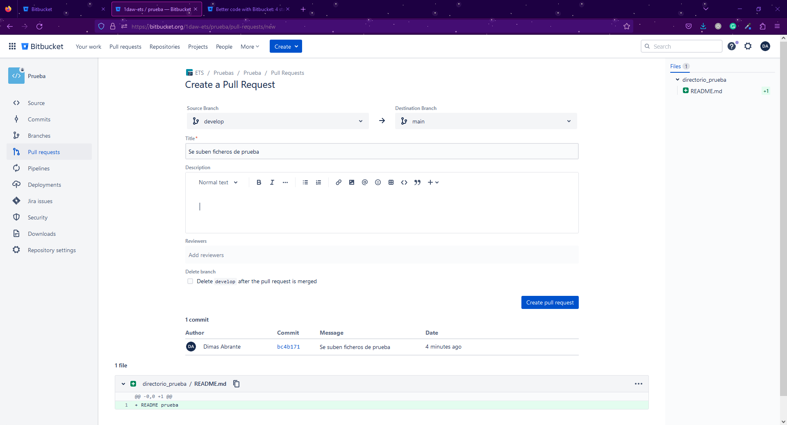

 

Una vez aprobado se puede proceder a realizar el merge. En esta parte del proceso se podrá poner un commit así como la estrategia de merge que se quiere seguir y si se ha de cerrar o no la branch.

 

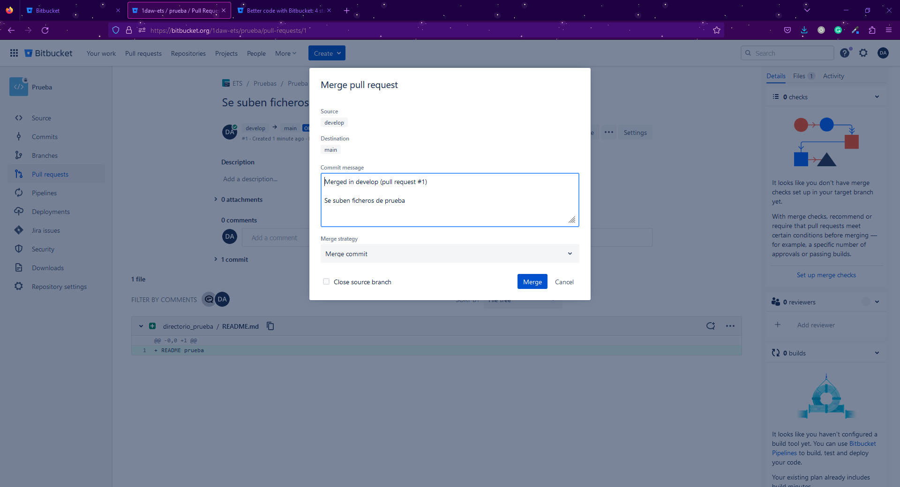

  

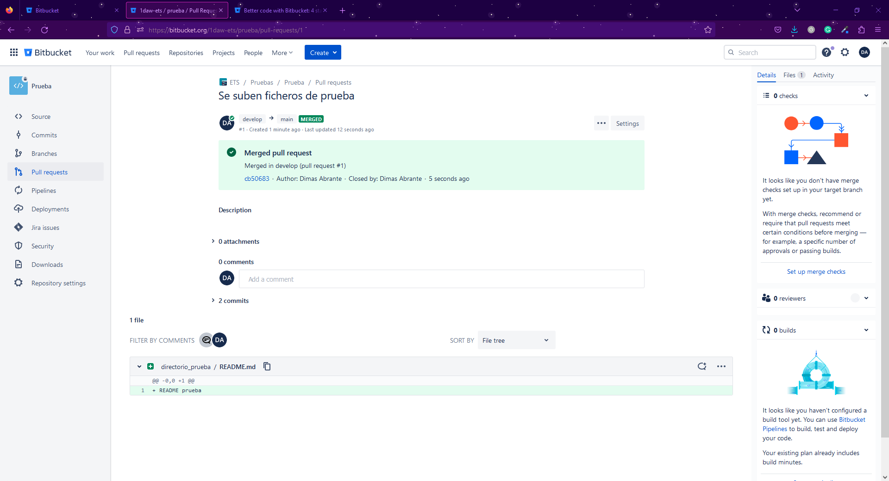

 

### Pipelines

Como se ha mencionado en apartados anteriores, Bitbucket Cloud cuenta con una herramienta CI/CD integrada, Pipelines. Ésta nos permite, a travéz de un fichero yml la automatización de procesos de integración y despliegue.

Para acceder a la creación de nuestro pipeline existen dos opciones. Se puede crear de forma manual, simplemente añadiendo un fichero yml desde cero o bien puede utilizarse las plantillas que proporciona la propia herramienta.

Una vez definido el fichero yml a utilizar, podrá ser accedido por pipelines a travéz de la plataforma. 

Para poder habilitar Pipelines se deberá habilitar primero la verificación en dos pasos.

 

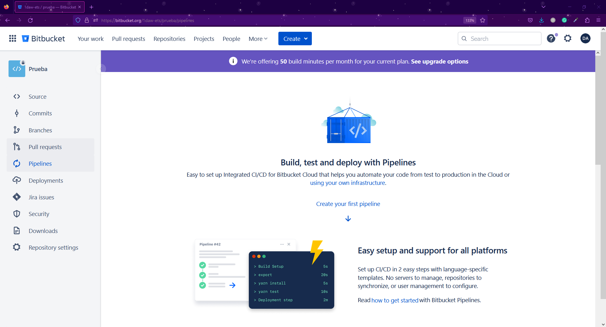

  

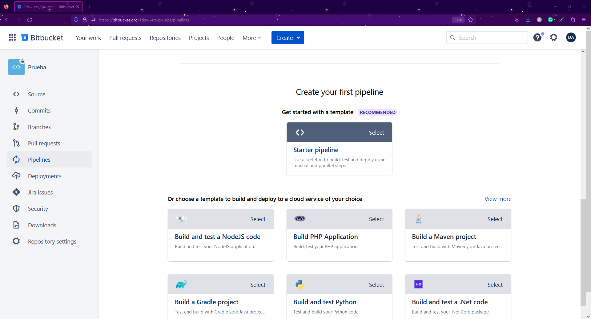

 

A continuación se muestran algunas de las plantillas disponibles

 

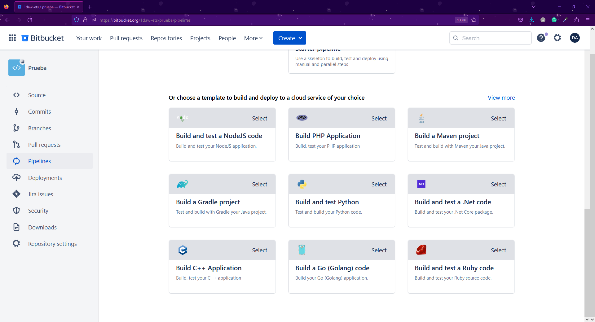

 

El fichero yml que se creará cuenta con una serie de apartados. En primer lugar encontramos la imágen que se va a utilizar, en este caso se trata de una máquina ubuntu, por lo que los scripts que se lanzarán serán en bash. Seguido de esto se encuentran una serie de pasos con sus propios nombres cada uno así como con el script deseado.

La última parte de este fichero corresponde a los pasos de despliegue, los cuales al igual que los anteriores tendrán un nombre, un script asociado así como triggers.

Además de todo esto, la interfaz de creación cuenta con un apartado de plantillas, opciones para añadir nuevos steps así como una amplia variedad integraciones.

A continuación el fichero yml en cuestión:

    # This is an example Starter pipeline configuration
    # Use a skeleton to build, test and deploy using manual and parallel steps
    # -----
    # You can specify a custom docker image from Docker Hub as your build environment.

    image: atlassian/default-image:3

    pipelines:
    default:
        - parallel:
        - step:
            name: 'Build and Test'
            script:
                - echo "Your build and test goes here..."
        - step:
            name: 'Lint'
            script:
                - echo "Your linting goes here..."
        - step:
            name: 'Security scan'
            script:
                - echo "Your security scan goes here..."
    branches: 
        main: 
        - parallel:
        - step:
            name: 'Build and Test'
            script:
                - echo "Esto es para probar"
        - step:
            name: 'Lint'
            script:
                - echo "Sigo probando"
        - step:
            name: 'Security scan'
            script:
                - echo "Magnífico"

    # The following deployment steps will be executed for each pipeline run. To configure your steps and conditionally deploy see https://support.atlassian.com/bitbucket-cloud/docs/configure-bitbucket-pipelinesyml/
    - step:
        name: 'Deployment to Staging'
        deployment: staging
        script:
          - echo "Your deployment to staging script goes here..."
    - step:
        name: 'Deployment to Production'
        deployment: production
        script:
          - echo "Your deployment to production script goes here..."

 

  

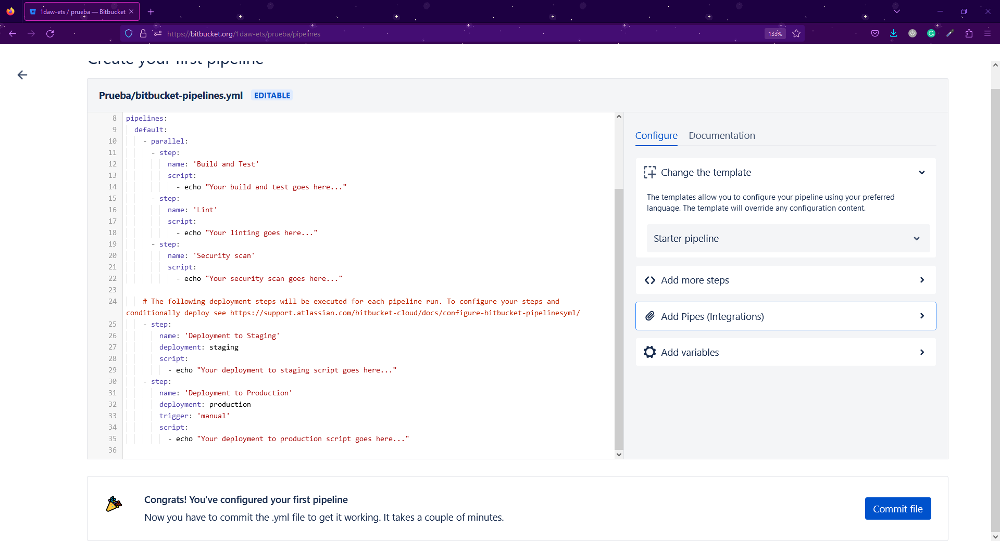

 

Por defecto el proceso CI/CD se ejecutará tras realizar un commit. 

Una vez realizado el proceso especificado en el trigger se irán realizando de manera secuencial los pasos descritos en el yml 

 

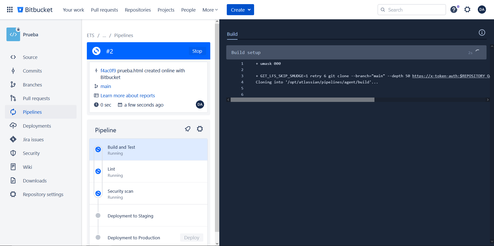

  

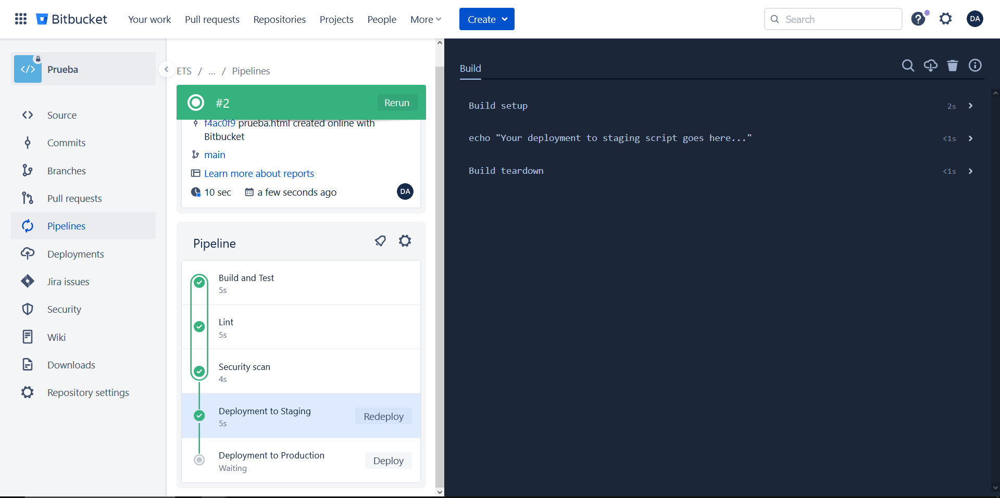

  

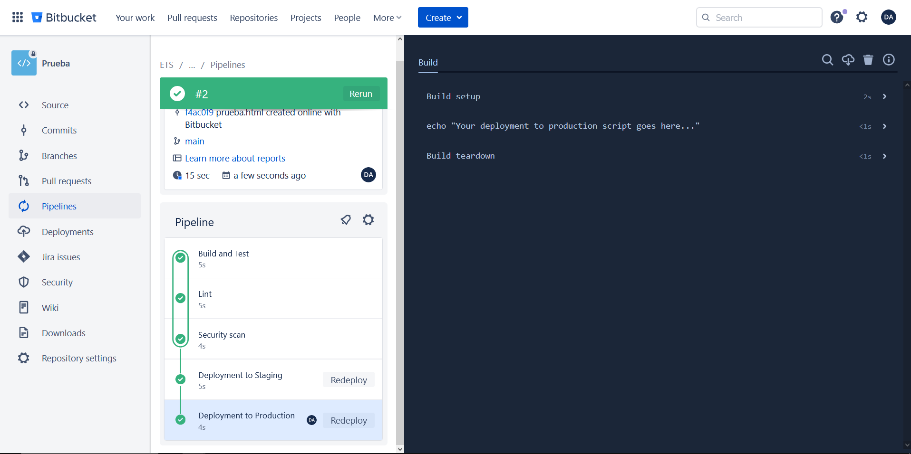

 

En este caso en particular, se ha especificado en el yml que el despliegue a producción se deba hacer de forman manual, es por esto que en la última imágen mostrada no aparece el deployment to production como finalizado. Para ello simplemente habrá que pulsar en el botón de deploy.

 

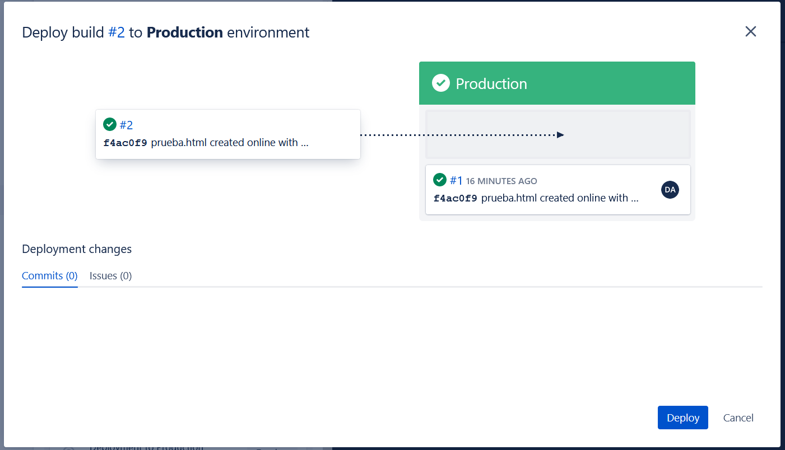

 

## 
Ejemplo documentación de proyecto

### Editor de documentos

Se pueden editar los documentos online. Permite obtener una previsualización de cómo se vería el documento, trabajar con diferentes sintaxis y visualizar solamente los cambios respecto al documento de partida. 

    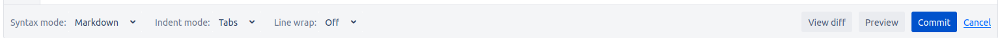

### Wikis

La creación de wikis en Bitbucket es muy sencilla. Simplmente habrá que implementar esta opción dentro de las opciones de nuestro repositorio. Una vez hecho esto se podrá elegir el tipo de wiki que deseamos crear, esta puede ser pública o privada, así como también se pujede agregar la opción de que cualquier persona con acceso a la misma pueda editarla.

 

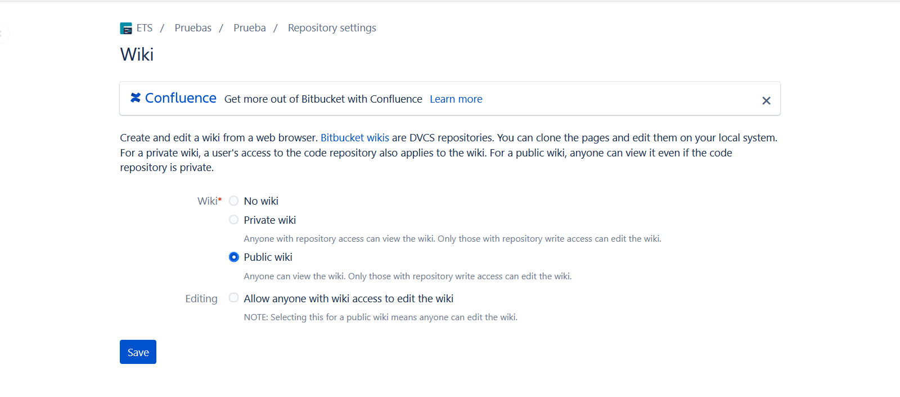

 

Una vez configurada nuestra wiki, solo queda añadirle la documentación deseada.

 

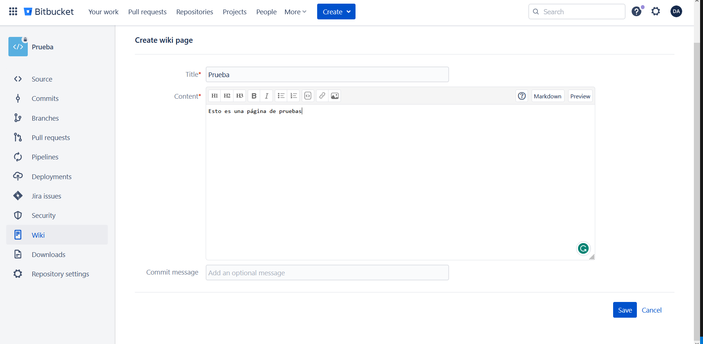

  

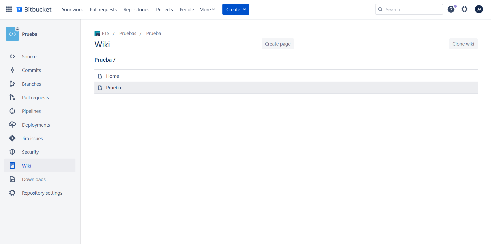

 

En el siguiente apartado se mostrará otra forma de realizar documentación a través de Confluence.

## 
Otras herramientas con las que se integran
 

    

Bitbucket está integrado con Jira, una herramienta, también de Atlassian, que permite gestionar equipos aplicando metodologías ágiles. Con Jira puedes gestionar tus proyectos durante todo su ciclo de vida dentro de un único contexto, facilitando así enormemente la coordinación y las tareas de seguimiento.  

Bitbucket avisa automáticamente a Jira de los cambios en el código, de forma que Jira puede generar toda la información asociada a los mismos: actualización de paneles, seguimiento de los "issues" en tiempo real, etc. De esta forma el programador ve aligerada su carga de trabajo asociada a la documentación y se evitan posibles discrepancias entre el estado real del código y el reflejado en las herramientas de gestión del proyecto. 

### Herramientas provistas por Jira

### Paneles

Jira permite la creación de tableros de incidencias para implementar metodologías ágiles como Scrum o Kanban entre otras.

    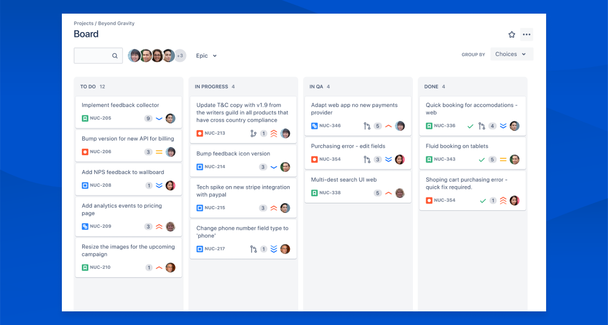

### Hojas de ruta

Las hojas de ruta permiten planificar la realización de las tareas sobre un eje temporal. Las tareas más grandes, las principales, se dividen en tareas más pequeñas, las secundarias. Las tareas secundarias son dependientes de la tearea principal que las origina, las dependencias entre diferenetes tareas principales tambíen se ven reflejadas y son tenidas en cuenta a la hora de realizar la planificación. 

    

### Informes

Jira facilita la generación de informes a partir de los datos generados dentro del contexto único de trabajo. Mediante diferentes vistas podemos obtener rápidamente un primer análisis sobre el estado de diferentes aspectos de nuestro proyecto. 

    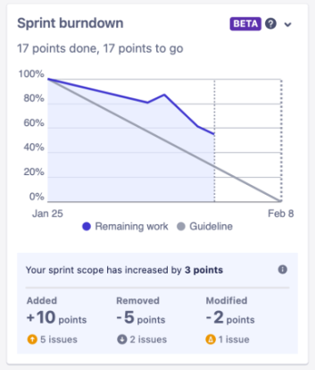 
    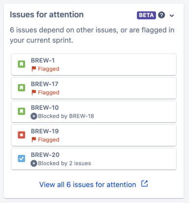

### Flujos de trabajo

Jira permite definir flujos de trabajo para los distintos tipos de incidencia existentes en el proyecto. Estos flujos de trabajo se pueden reutilizar en diferentes proyectos, generando así un marco de trabajo uniforme, tanto para los desarrolladores como para los ingenieros. 

    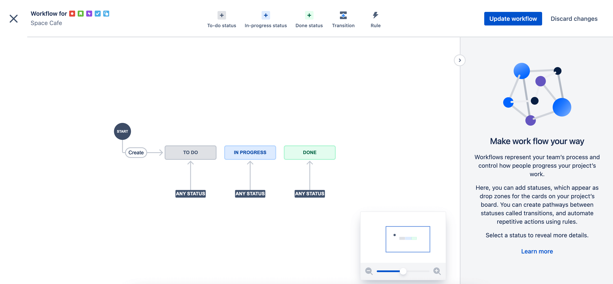 

### Incidencias y tareas

Las incidencias y tareas se pueden definir de manera similar a los flujos de trabajo. En Jira se pueden establecer relaciones jerárquicas entre los diferentes tipos de incidencias y tareas, así como indicar dependencias con otras ramas.

    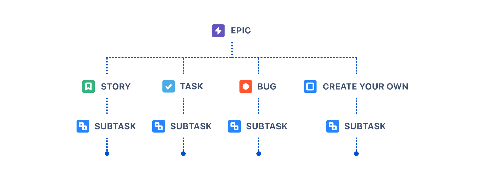 

### Integraciones

Atlassian dispone de un 'Marketplace' donde obtener aplicaciones que son totalmente integrables con Jira. Estas aplicaciones o 'plugins' permiten ampliar y mejorar las funcionalidades de la instancia de Jira.

<a href="https://marketplace.atlassian.com/">Marketplace de Atlassian</a>

### Automatización

La automatización de tareas de Jira consiste en programar una serie de reglas dentro del contexto de trabajo. Estas reglas constan de tres partes:

<ol>
    <li>Desencadenadores o "Triggers"</li>
    <li>Condiciones</li>
    <li>Acciones</li>
</ol>

Combinando estos tres elementos se pueden programar desde tareas sencillas, como cerrar automaticamente una incidencia, hasta tareas complejas que impliquen la comprobación del estado del proyecto o permisos concedidos a los actores involucrados.

    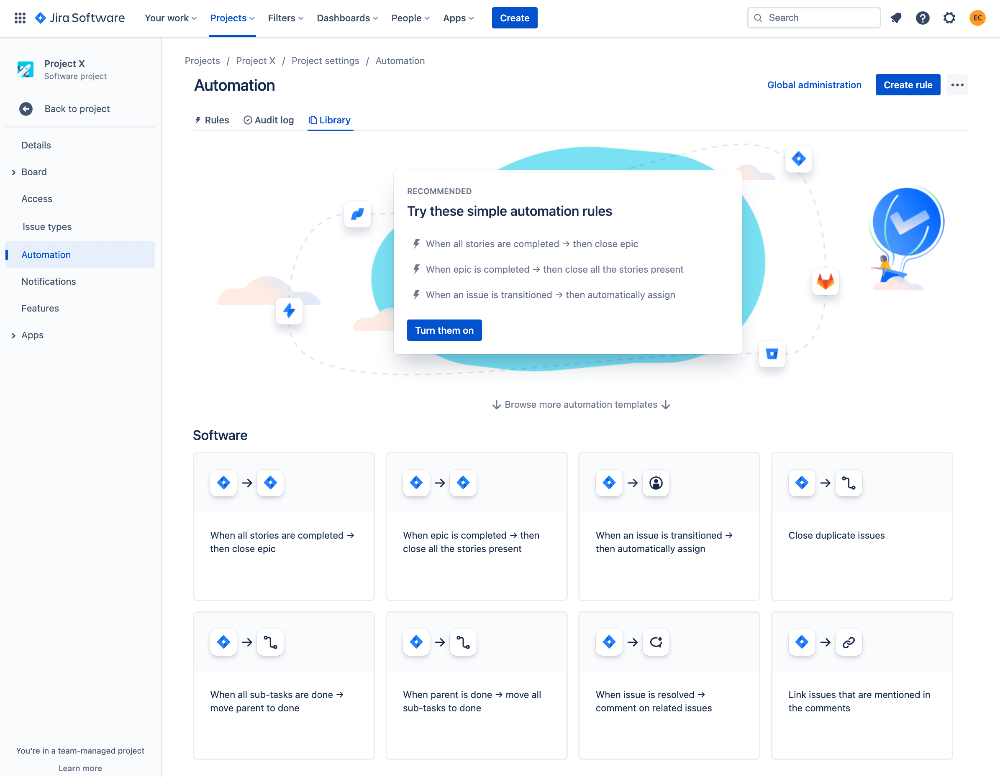 

    

Trello es una herramienta de gestión de proyectos muy visual y accesible. También aporta posibilidades de automatización de tareas y opciones de personalización de funcionalidades. 

El elemento fundamental entorno al que gira todo es el tablero. El tablero nos aporta una visión general del estado del proyecto. 

    

Dentro del tablero se distinguen diferentes listas. Cada lista define una etapa por la que debe pasar una tarea durante su ciclo de vida. Trello permite al usuario definir sus propias listas, generando así un flujo de trabajo a medida de sus necesidades.

Las tareas se representan mediante tarjetas. Cada tarjeta contiene toda la información necesaria para la correcta realización y seguimiento de la tarea asociada. Las tarjetas se desplazan por las diferentes listas definidas en el tablero a medida que van siendo atendidas. 

### La tarjeta

    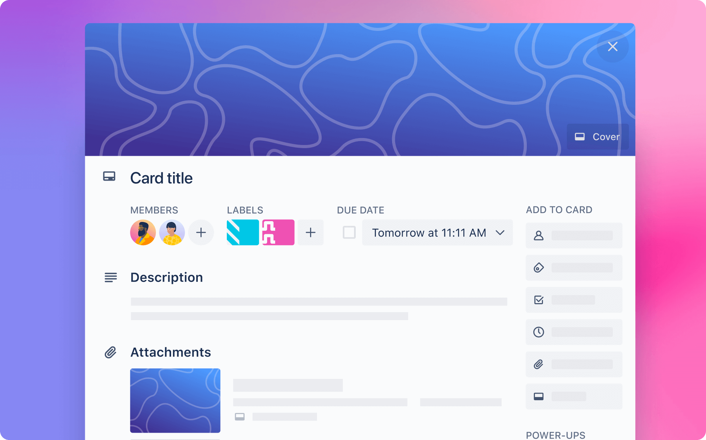

### Miembros

Se indican los actores implicados en atender las tareas.

### Fechas de entrega

Controla los tiempos: fechas de entrega, recordatorios, checklists, etc.

### Adjuntos

Indica en la propia tarjeta los documentos relevantes para atenderla.

### Checklists

Divide las tareas más grandes en otras más pequeñas. Ve indicando las tareas parciales completadas para ir dejando constancia del progreso realizado.

## Vistas

Trello ofrece vistas predefinidas que nos aportan una visión más en detalle de los diferentes aspectos del proyecto. 

### La vista 'Timeline'

Provee una vista de la hoja de ruta del proyecto, indicando las diferentes etapas definidas y los diferentes actores asociados a cada línea de trabajo.

    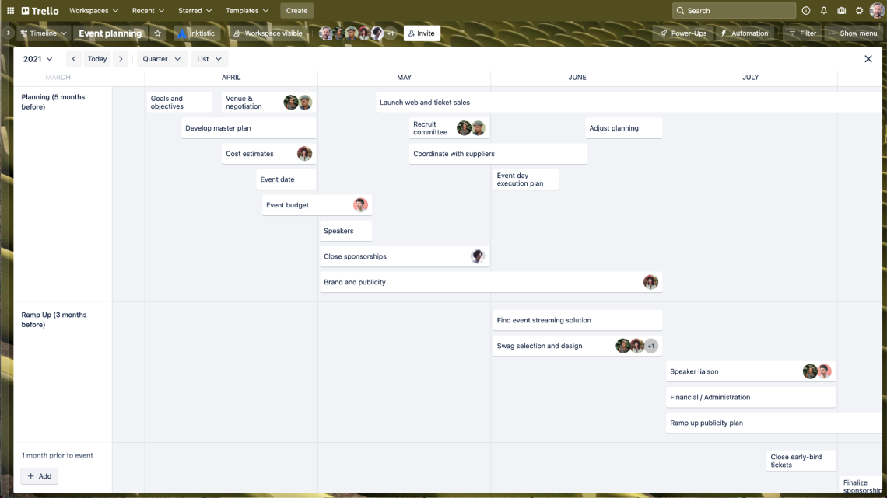

### La vista 'Calendar'

Permite organizar la actividad diaria del equipo, estableciendo prioridades y facilitando el reparto de la carga de trabajo.

    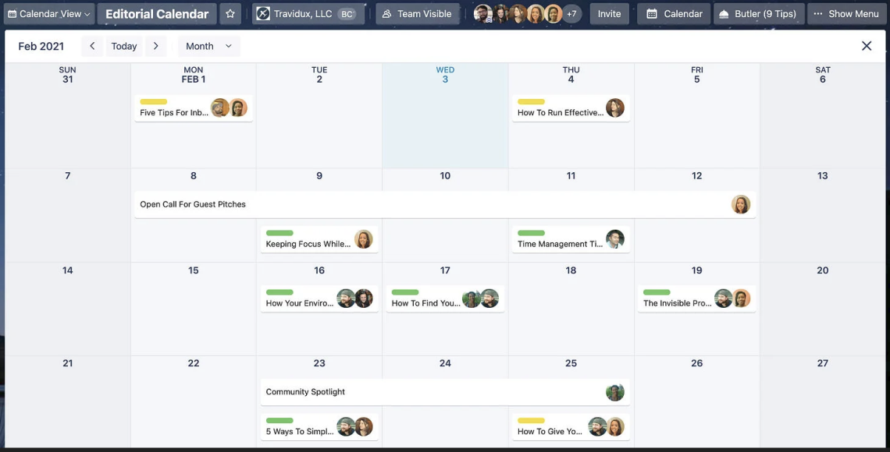

### La vista 'Dashboard

Genera una representación visual de los datos del proyecto, permitiendo elaborar informes y facilitando la toma de decisiones.

    

Existen otras vistas predefinidas y también la posibilidad de crear vistas personalizadas para adaptarse a las necesidades particulares del usuario. 

### Integración

Trello permite la integración de aplicaciones para ampliar o adaptar sus funcionalidades. 

<a href="https://trello.com/power-ups">Power-ups para Trello</a>

### Automatización

Mediante 'Butler', Trello permite automatizar casi cualquier acción mediante la creación de reglas, comandos y botones. La programación se realiza sin necesidad de escribir el código, haciéndolo accesible a todo tipo de usuarios.

    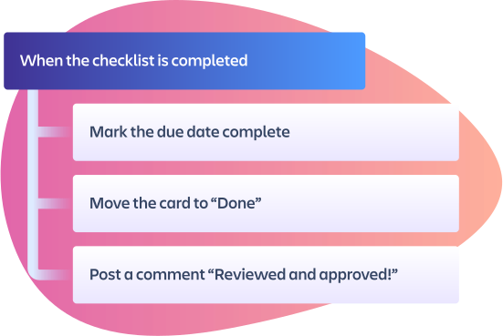

    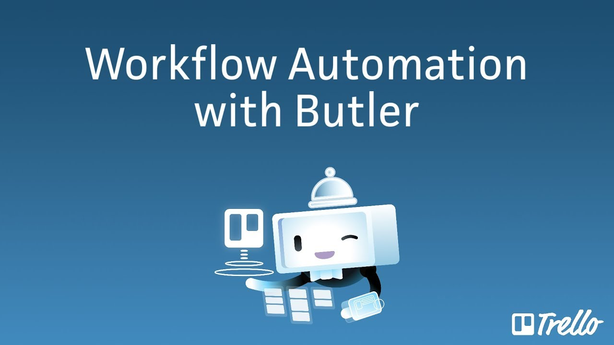

  

 

Para la documentación de proyectos existe una herramienta propiedad de Atlassian, Confluence, una de las más utilizadas junto con Notion para la creación de wikis.

Esta herramienta se integra muy bien con otras como puede ser Jira y Trello. Además da la opción de exportar la documentación a diversos formatos como PDF, HTML y XML.

Para la utilización de esta herramienta solo será necesaria una cuenta de Atlassian. Una vez ingresamos a la plataforma se podrá definir un espacio, éste será el lugar de documentación.

Así pues Confluence nos da la opción de utilizar una serie de plantillas o bien crear nuestro espacio desde cero.

 

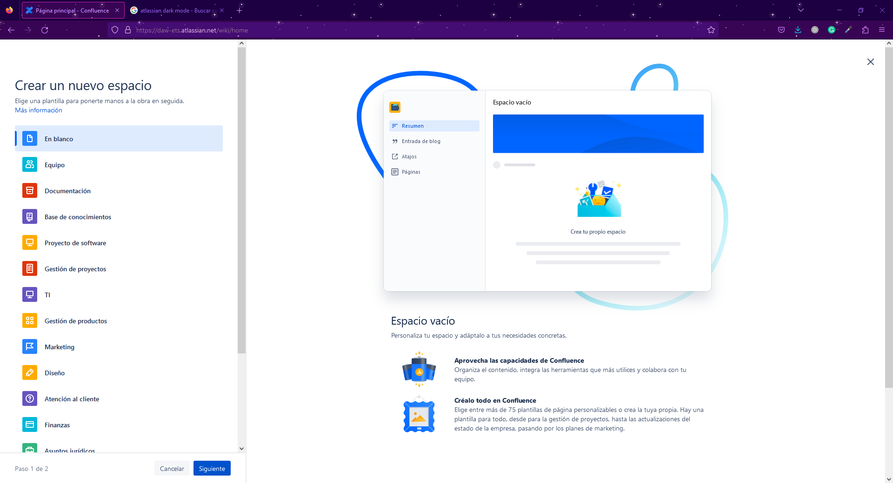

 

Una vez elegida la plantilla (en nuestro caso se utilizará la de documentación), se deberá de dar un nombre al mismo.

 

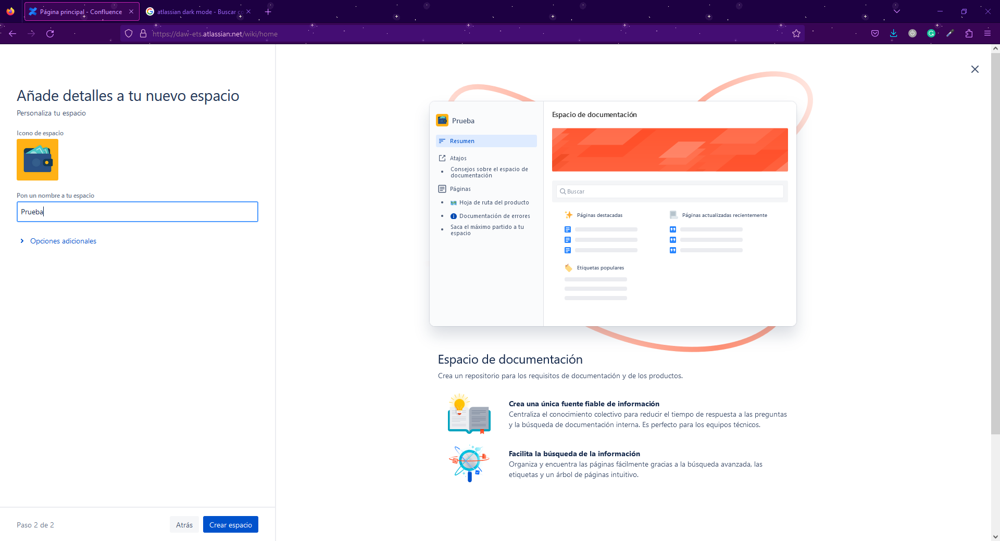

 

Definido el espacio, solo queda la creación de páginas. Para ello, en la parte izquierda de la interfaz se encuentra la opción de creación de nuevas páginas.

 

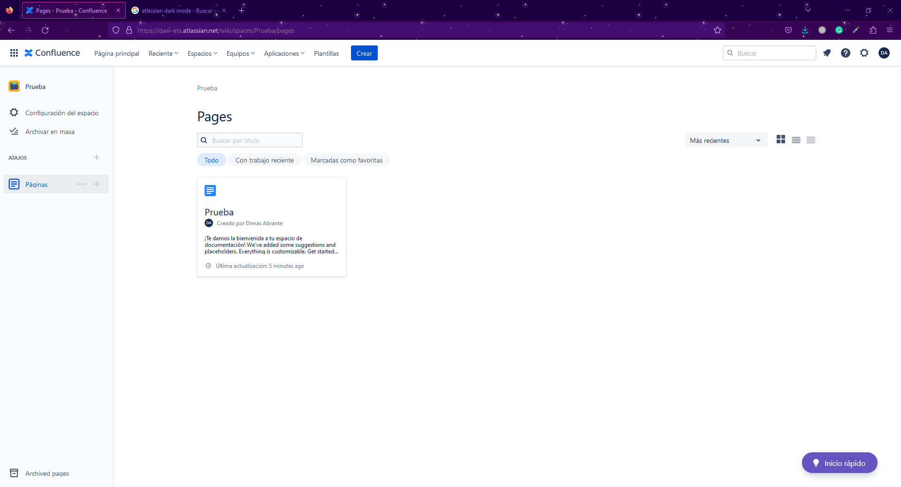

 

Al igual que en la creación de espacios, cada página puede ser creada desde cero o utilizar plantillas que se ajusten a nuestras necesidades. En este caso, por ejemplo, se han utilizado las plantillas de "Artículos de instrucciones" y "Artículo de solución de problemas". Cada una de ellas especifica el contenido que deberíamos de volcar en las mismas.

Además cabe la posibilidad de importar nuestros propios documentos externos para convertirlos en una página de confluence.

 

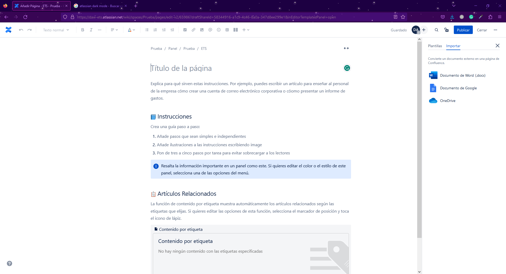

  

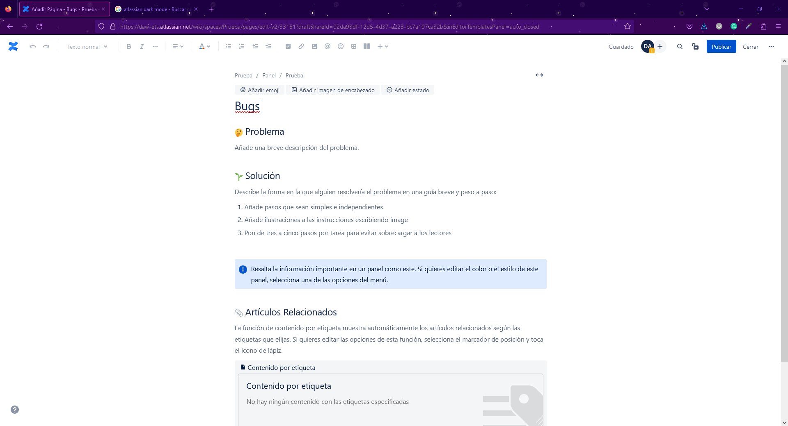

 

Creadas las páginas estas se verán en nuestro espacio de la siguiente manera

 

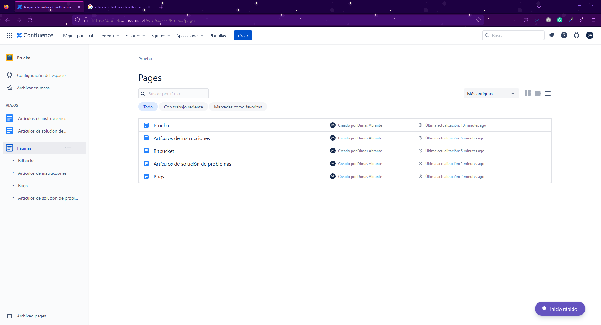

 

Por último, Confluence nos brinda la opción de realizar exportaciones de nuestros espacios en formato CSV, HTML, XML y PDF.
    
 

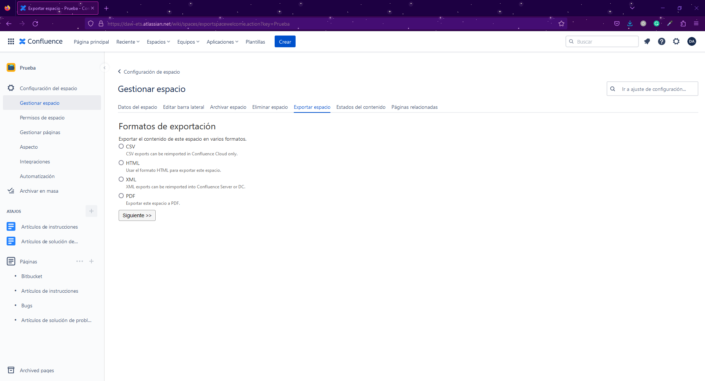

 

https://www.youtube.com/watch?v=slU60fbyj70
    
