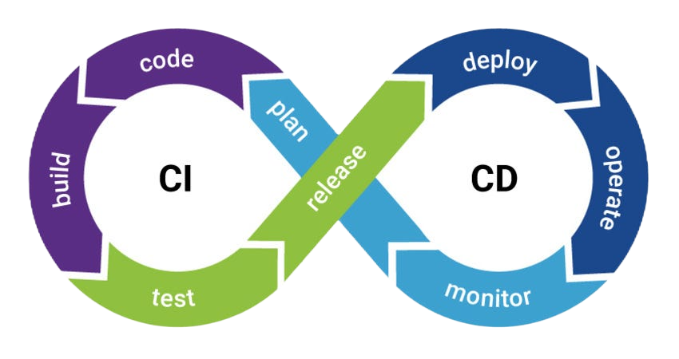

# Bitbucket

Bitbucket es una herramienta que aloja código con la colobaración de git.
La ventaja que tiene esta aplicación consiste en que tiene integrado con Jira y Trello, almacena código hacia la nube y crea y evalua automáticamente con la entrega continua integrada.

# ¿Qué son las herramientas CI/DC?

Bitbucket tiene integrado una forma para evalua automáticamente el codigo que has creado que consiste en CI/CD que es un método para distribuir las aplicaciones, mediante el uso de la automatización en las etapas del desarrollo de las aplicaciones. Los principales conceptos de esta aplicación son la integración, la distribución y la implementación continuas.
 
 

 
 
## Integración continua

La integración continua (CI) permite que los desarrolladores funcionen los cambios en un repositorio compartido para haci evitar un conflicto con las modificaciones que otros desarrolladores implementan al mismo tiempo.

## Distribución continua

La distribución continua (CD) consiste en tener una base de código que pueda implementarse en el entorno de producción en cualquier momento.

## Implementación continua

La implementación continua (CI/CD) es el encargado de automatizar el lanzamiento de la aplicación a la producción.
 
 
# Integración de otras herramientas

Bitbucket tiene unas herramientas integrada en sus sistema y una de ella es Jira que es una herramienta de desarrollo de software que los ingenieros utilizan para rastrear y administrar tareas, es compatible con cualquier metodología ágil por ejemplo scrum, kanban, etc.
También está Trello que es una herramienta que permite gestionar cualquier tipo de proyecto y flujo de trabajo como también supervisar tareas.
 
 

