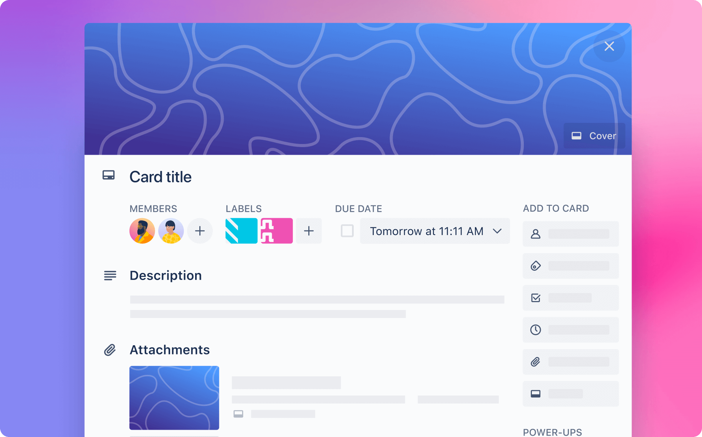
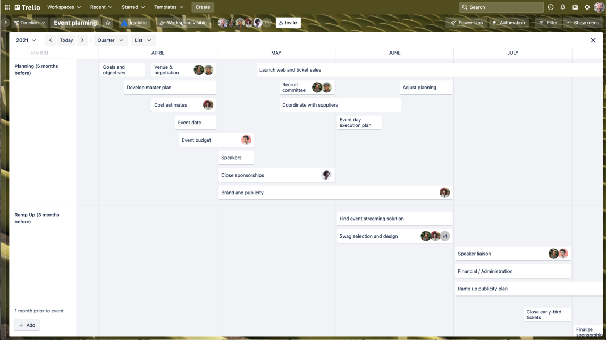
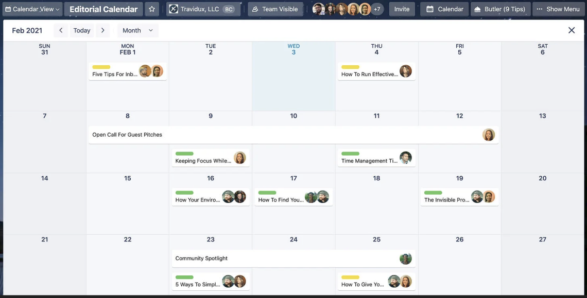
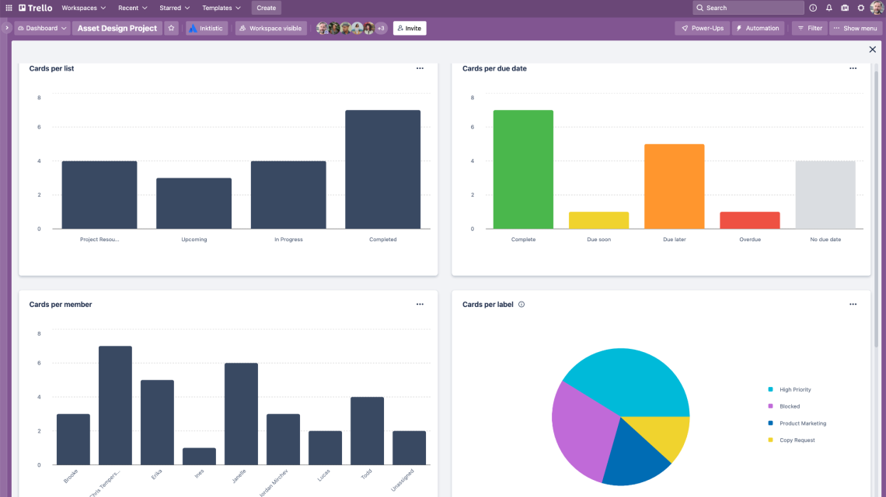
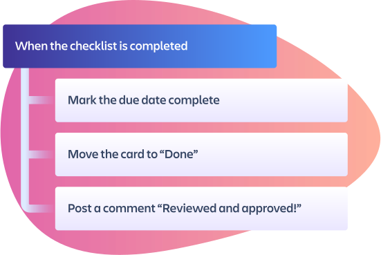
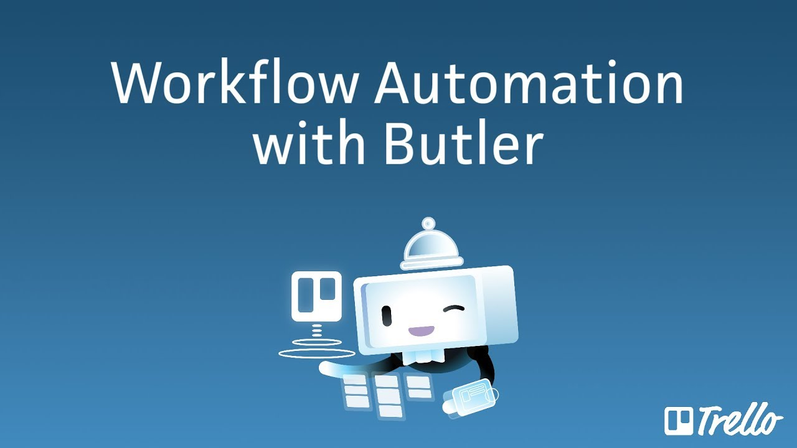

    

Trello es una herramienta de gestión de proyectos muy visual y accesible. También aporta posibilidades de automatización de tareas y opciones de personalización de funcionalidades. 

El elemento fundamental entorno al que gira todo es el tablero. El tablero nos aporta una visión general del estado del proyecto. 

    

Dentro del tablero se distinguen diferentes listas. Cada lista define una etapa por la que debe pasar una tarea durante su ciclo de vida. Trello permite al usuario definir sus propias listas, generando así un flujo de trabajo a medida de sus necesidades.

Las tareas se representan mediante tarjetas. Cada tarjeta contiene toda la información necesaria para la correcta realización y seguimiento de la tarea asociada. Las tarjetas se desplazan por las diferentes listas definidas en el tablero a medida que van siendo atendidas. 

## La tarjeta

    

### Miembros

Se indican los actores implicados en atender las tareas.

### Fechas de entrega

Controla los tiempos: fechas de entrega, recordatorios, checklists, etc.

### Adjuntos

Indica en la propia tarjeta los documentos relevantes para atenderla.

### Checklists

Divide las tareas más grandes en otras más pequeñas. Ve indicando las tareas parciales completadas para ir dejando constancia del progreso realizado.

## Vistas

Trello ofrece vistas predefinidas que nos aportan una visión más en detalle de los diferentes aspectos del proyecto. 

### La vista 'Timeline'

Provee una vista de la hoja de ruta del proyecto, indicando las diferentes etapas definidas y los diferentes actores asociados a cada línea de trabajo.

    

### La vista 'Calendar'

Permite organizar la actividad diaria del equipo, estableciendo prioridades y facilitando el reparto de la carga de trabajo.

    

### La vista 'Dashboard

Genera una representación visual de los datos del proyecto, permitiendo elaborar informes y facilitando la toma de decisiones.

    

Existen otras vistas predefinidas y también la posibilidad de crear vistas personalizadas para adaptarse a las necesidades particulares del usuario. 

## Integración

Trello permite la integración de aplicaciones para ampliar o adaptar sus funcionalidades. 

<a href="https://trello.com/power-ups">Power-ups para Trello</a>

## Automatización

Mediante 'Butler', Trello permite automatizar casi cualquier acción mediante la creación de reglas, comandos y botones. La programación se realiza sin necesidad de escribir el código, haciéndolo accesible a todo tipo de usuarios.

    

    

