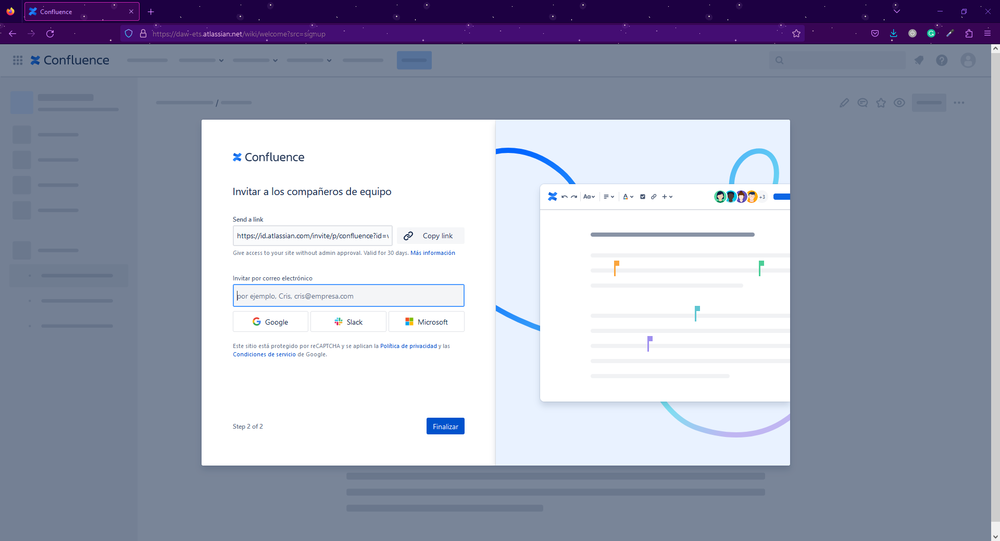

  

# 
 Bitbucket 

## Documentación

 

 

Para la documentación de proyectos existe una herramienta propiedad de Atlassian, Confluence, una de las más utilizadas junto con Notion para la creación de wikis.

Esta herramienta se integra muy bien con otras como puede ser Jira y Trello. Además da la opción de exportar la documentación a diversos formatos como PDF, HTML y XML.

Para la creación de la documentación será necesario crear una cuenta en atlasian y posteriormente darle nombre a nuestro dominio donde se alojarán nuestros diferentes espacios de trabajo.

  

 

Una vez creada la cuenta se deberá de especificar el nombre del equipo, así como también se podrán invitar directamente a los colaboradores por medio de correo electrónico o un link.

 

  

 

Una vez rellenada la información necesaria, se podrá crear un espacio de trabajo. Esta opción se encuentra en la parte superior derecha de la página principal.

 

 

En la creación de un nuevo espacio, se podrá elegir un espacio en blanco para definir nosotros la organización o bien se podrá elegir una de las plantillas que nos ofrece la propia herramienta.

 

 

Una vez elegida la plantilla (en nuestro caso se ha elegido la plantilla de documentación), se le deberá de dar un nombre al espacio

 

  

 

Creado el espacio, solo queda la creación de páginas. Para ello en la parte izquierda del espacio encontraremos la opción para la creación de nuevas páginas.

 

 

Al igual que en la creación de espacios, cada página puede ser creada desde cero o utilzar plantillas que se ajusten a nuestras necesidades. En este caso, por ejemplo se han utilizado las plantillas de "Artículois de instrucciones" y "Artículo de solución de problemas". Cada una de ellas especifica el contenido que deberiamos de volcar.

Además es posible importar nuestros propios documentos externos para convertilos en una página de confluence.

 

  

 

Creadas las páginas estas se verían en nuestro espacio de la siguiente manera

 

 

Por último, Confluence nos brinda la opción de realizar exportaciones de nuestros espacios en formato CSV,HTML,XML y PDF.

 

