

  

# 
 Bitbucket 

Una vez nos hemos registrado en Bitbucket (bien sea con una cuenta de google o incluso con una cuenta de Github), el siguiente paso es crear nuestro workspace, el cual tendrá un nombre y una url única.

Un workspace es un espacio donde podremos agrupar todos nuestros repositorios dedicados a un tema en concreto. Es posible tener más de un workspace, lo que nos permite una mejor organización.

 

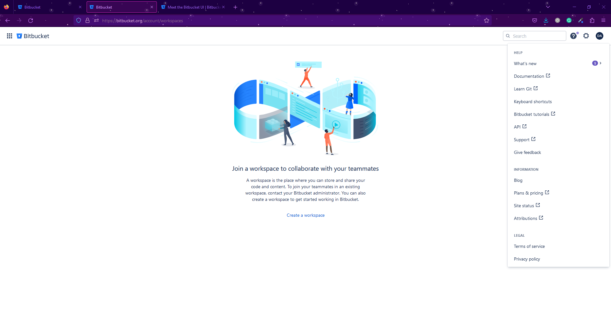

  

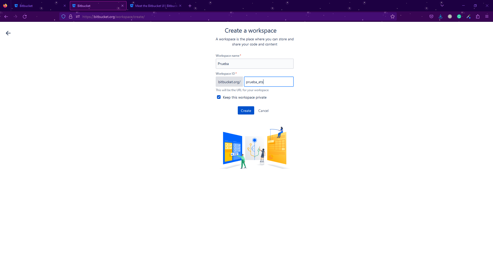

  

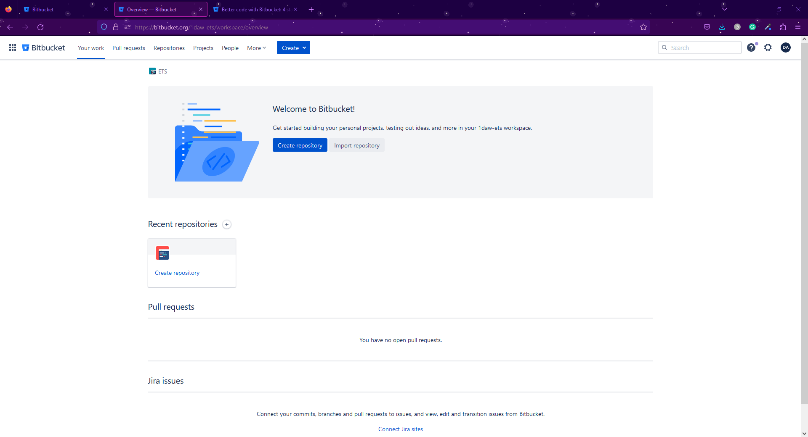

 

Una vez dentro de nuestro Workspace tendremos la opción de crear nuestro repositorio. En este apartado podremos darle un nombre al projecto para así agrupar diferentes repositorios en uno mismo. Además también tendremos la opción de proporcionar un nombre de repositorio, el tipo de acceso que tendrá el mismo, la inclusión de un README con plantilla, el nombre de la branch principal y la inclusión o no de un .gitignore.

 

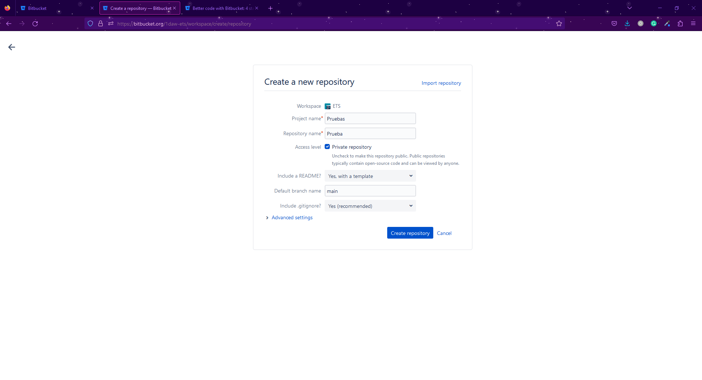

  

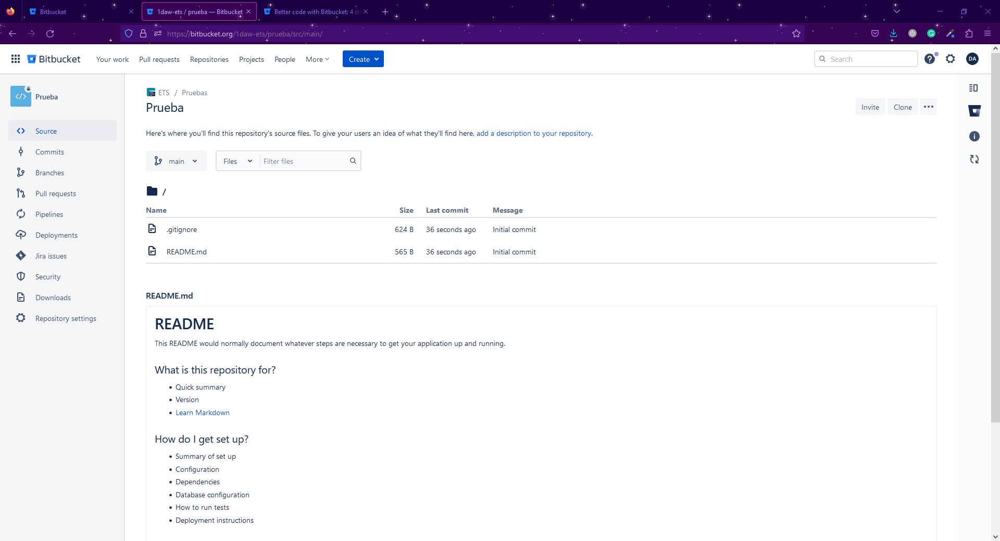

 

Una vez creado el repositorio este podrá ser clonado en remoto por medio de HTTPS o SSH.

 

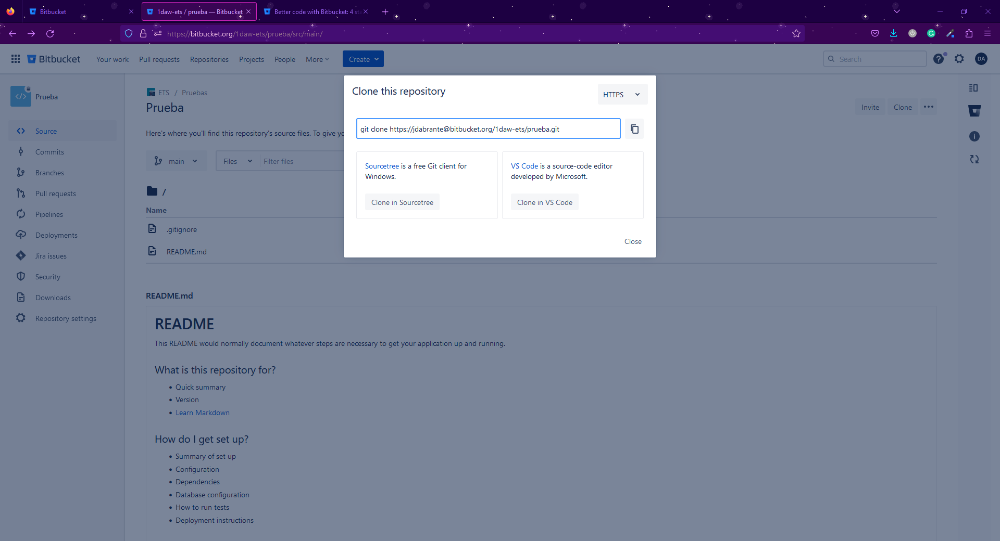

 

Para la creación de una nueva rama en el desplegable de la izquierda se encuentra la opción de "Branches" donde podremos administrar las mismas.
Dentro de esta opción podremos especificar el tipo de rama que vamos a crear, de que otra rama hereda el contenido así como el nombre que le queremos dar.

 

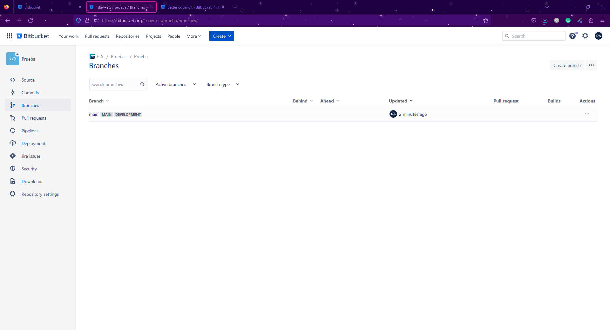

  

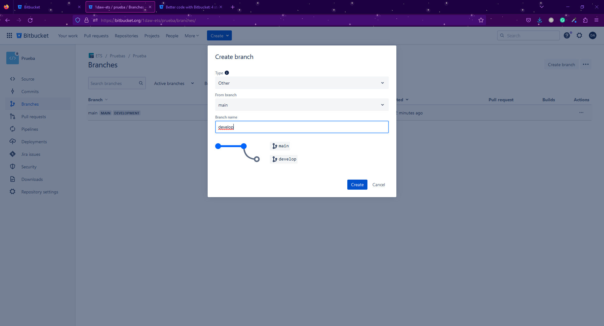

 

La siguiente característica a ver son los pull request. Una vez se haya realizado un cambio en la nueva rama y este se haya subido al repositorio remoto, se podrá hacer un pull request a otros colaboradores para revisar los cambios y aceptarlos para realizar el merge con la rama main o master.

 

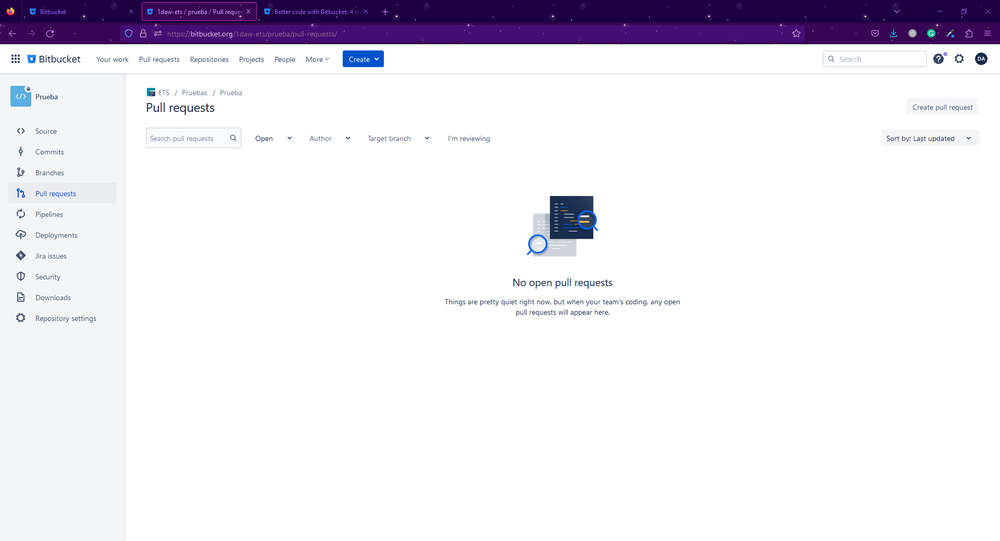

 

En este apartado se puede poner un título al pull request, especificar que ramas se quieren mezclar, una descripción de lo que se ha hecho para que los colaboradores tengan más información, qué colaboradores deben hacer la review así como también si la rama en cuestión ha de borrarse una vez hecho el merge.

 

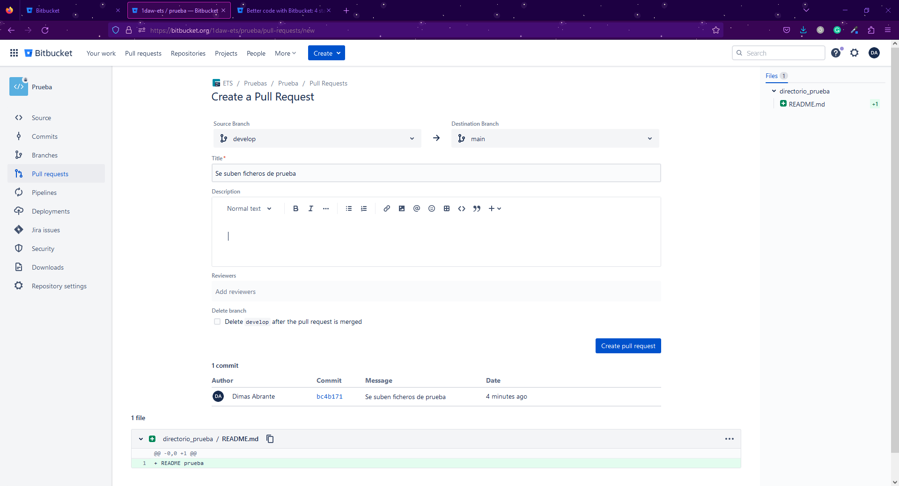

 

Una vez aprobado se puede proceder a realizar el merge. En esta parte del proceso se podrá poner un commit así como la estrategia de merge que se quiere seguir y si se ha de cerrar o no la branch.

 

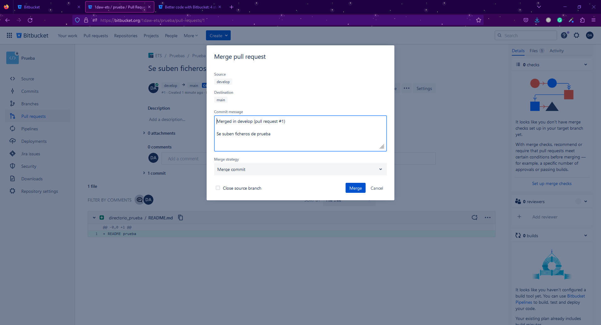

  

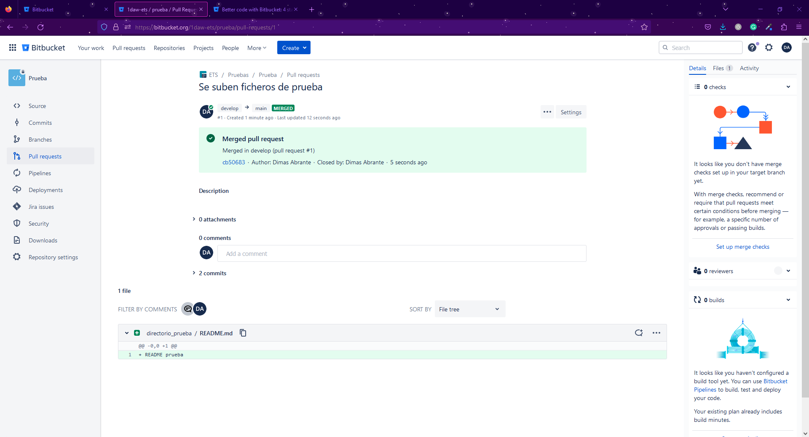

