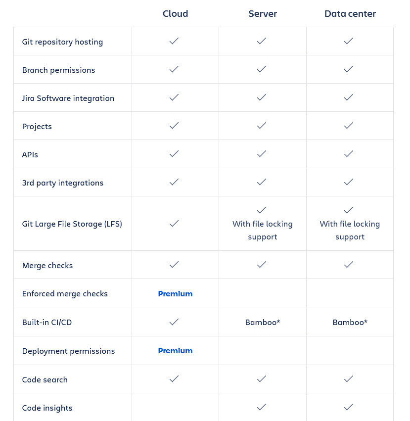

  

# 
 Bitbucket 

## Planes y precios

Bitbucket es una herramienta gratuita, sin embargo cuenta con una versión premium la cual cambia alguna de las características de los diferentes <a href="../que_ofrece/README.md">servicios de hosting</a>

En la siguiente imagen se muestran aquellas características solo disponibles para la versión premium.

 

 

Así pues los planes disponibles serían los siguientes

 

 

- El primer plan es el gratuito, el cual nos permite tener hasta 5 colaboradores, un tiempo de compilación de 50 minutos por mes, así como una capacidad de almacenamiento de hasta 1GB. No incluye una protección contra sobrecostes.

- El plan standard cuesta 3 dólares por usuario al mes, con una tarifa plana de 15 dólares al mes para entre 1 a 5 usuarios. El tiempo de compilación en este caso es de 2500 minutos por mes y la capacidad de alamacenamiento de hasta 5 GB. La protección contra sobrecostes está incluida.

- El plan premium cuesta 6 dólares por usuario al mes, con una tarifa plana de 30 dólares para entre 1 y 5 usuarios. El tiempo de compilación es de 3500 minutos por mes, con una capacidad de almacenamiento de hasta 10 GB. Además cuenta con un checkeo de mezclas, permisos de despliegue, lista de IP permitidas, verificación en dos pasos y control de acceso. La protección contra sobrecostes está incluida.

En la siguiente página se muestran estas mismas características con sus correspondientes precios

<a href="https://www.atlassian.com/software/bitbucket/pricing">Planes y precios</a>

